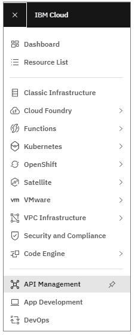
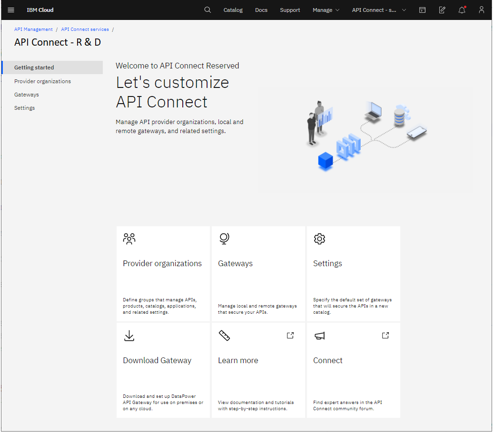

---

copyright:
  years: 2020
lastupdated: "2020-10-15"

keywords: IBM Cloud, API Connect, V10, Reserved plan, lifecycle, develop, create, manage, API, user, role, access, group

subcollection: apiconnect

---

{:external: target="_blank" .external} 
{:shortdesc: .shortdesc}
{:codeblock: .codeblock}
{:pre: .pre}
{:screen: .screen}
{:tip: .tip}
{:important: .important}
{:note: .note}

# Managing users
{: #ri-mng-users}

Define access groups and roles that determine user permissions, and then add users to the appropriate groups to ensure proper access to {{site.data.keyword.apiconnect_short}}.
{: shortdesc}

In {{site.data.keyword.apiconnect_short}} V10 Reserved, user access is managed with the {{site.data.keyword.cloud_notm}} Identity and Access Management (IAM) service. Create a provider organization in {{site.data.keyword.apiconnect_short}}, and use the IAM service to define access groups that represent the members of your provider organization, and then assign roles to each access group to grant permissions to users.

Complete the following steps to grant members of your {{site.data.keyword.cloud_notm}} account the appropriate access to {{site.data.keyword.apiconnect_short}}.

## Step 1. Determine access needs for users
{: #plan_access_ri-mng-users}

In {{site.data.keyword.apiconnect_short}}, permissions to use features and assets are controlled with user roles. The user roles are designed to enable people to perform the following jobs: API Developer, API Administrator, and Product Manager. Each job represents a set of related tasks that contribute to developing and managing APIs, products, and related assets. The {{site.data.keyword.apiconnect_short}} jobs are simply a way to help you plan access needs for your users, and you do not have to use them if they don't fit your needs. For more information on the {{site.data.keyword.apiconnect_short}} jobs, see [Who does what in {{site.data.keyword.apiconnect_short}}?](/docs/apiconnect?apiconnect-ri-user-over#whodoeswhat_ri-user-over).

To decide what type of access each of your users requires, review Table 1 to see how suggested jobs in {{site.data.keyword.apiconnect_short}} map to access roles in IAM. Then decide how many access groups you should create, and which IAM roles should be assigned to each access group. When you configure the access groups, you can assign them to one or more provider organizations for your {{site.data.keyword.apiconnect_short}} Reserved plan.

| {{site.data.keyword.apiconnect_short}} job | Needs this IAM role | Allowed actions |
| ----------------- | ------------------------------------------- |
| API Developer     | Service: Writer                    | Create, edit, and publish APIs                              |
| API Administrator	| Service: Manager, Platform: Editor | Create, edit, and publish APIs; Full control over data within the service; Modify the service instance |
| Product Manager	| Platform: Operator                 | Create, edit, and publish APIs |
| Administrator	    | Platform: Administrator            | Full control of the service instance |
{: caption="Table 1. Mapping {{site.data.keyword.apiconnect_short}} jobs to IAM roles" caption-side="top"}

IAM provides roles for both the platform (the service instance itself) and the service (the product features provided in the service instance). {{site.data.keyword.apiconnect_short}} administrators and API administrators perform tasks that use the platform roles; for example, provisioning a service instance and managing user access to it. Other users perform tasks that use the service roles; for example, creating an API or viewing event analytics.

Table 1 suggests IAM roles for typical {{site.data.keyword.apiconnect_short}} jobs. You might want to assign different IAM roles to a job, or to create custom roles. For a complete list of the IAM roles and how they are used in {{site.data.keyword.apiconnect_short}}, see [Managing access](/docs/apiconnect?topic=apiconnect-iam).

## Step 2. Create a provider organization in {{site.data.keyword.apiconnect_short}}
{: #porg_ri-mng-users}

Use the {{site.data.keyword.apiconnect_short}} administration console to create provider organizations that you will map to IAM roles.

### What is a provider organization?
{: #whatis-porg_ri-mng-users}

In {{site.data.keyword.apiconnect_short}}, users are grouped into _provider organizations_. Each provider organization owns a set of assets includeing APIs, products, catalogs, and developer portals. You can create a single provider organization (for example, in a small company) or create multiple provider organizations (for example, different departments in a large company). 

After you create a provider organization, use the {{site.data.keyword.cloud_notm}} Identity and Access Management (IAM) service to set permissions for it. You can define IAM access groups with policies that determine permissions within each provider organization in {{site.data.keyword.apiconnect_short}}, and then you can add members of your company's {{site.data.keyword.cloud_notm}} to the appropriate access groups, which results in the users becoming members of the provider organization. 

### Creating a provider organization
{: #create-porg_ri-mng-users}

All of the members of a provider organization have some level of access to the assets belonging to that provider organization. The admin who creates a provider organization is automatically designated as the owner.

1. Open the {{site.data.keyword.apiconnect_short}} Reserved administration console.

   a. [Log in](https://cloud.ibm.com/login/){: external} to {{site.data.keyword.cloud_notm}}.
  
   b. On the Dashboard, click  and select **API Management**.

     

   c. In the navigation list, expand **API Connect** and click **Services**.

      

      The "Services" page lists all of your {{site.data.keyword.apiconnect_short}} services. 
   
   d. On the "Services" page, click your Reserved plan name to start it.

      {{site.data.keyword.apiconnect_short}} opens to the administration console.
	  
	  
   
2. On the administration console's home page, click the **Provider organizations** tile.

3. On the "Provider organizations" page, click **Create provider organization**.

4. On the "Create provider organization" page, provide a **Service name**, select a **Resource group**, and then click **Create**.

   The service name is the display name of your provider organization. Treating the provider organization as a service allows {{site.data.keyword.cloud_notm}} to manage access to the provider organization (and all of its assets) indepently from other {{site.data.keyword.apiconnect_short}} resources.

Next, create access groups that you can assign to the provider organization to control access to your Reserved plan.

## Step 3. Create an access group in IAM
{: #create-group_ri-mng-users}

In IAM, an access group contains a set of users that are assigned to the same access roles for the same {{site.data.keyword.cloud_notm}} resource.

1. [Log in](https://cloud.ibm.com/login/){: external} to {{site.data.keyword.cloud_notm}}.
  
2. On the {{site.data.keyword.cloud_notm}} Dashboard, locate the "User access" tile and click **Manage users**.

   The IAM service dashboard opens to the "Access (IAM)" page.

3. On the "Access (IAM)" page, look in the navigation menu and click **Access groups**.

4. On the "Access groups" page, click the **Create** button, provide a name and description for the new access group, and then click **Create**.

The new access group displays on the "Access groups" page. Next, assign policies to the access group.
   

## Step 4. Assign policies to the access group
{: #assign-policies_ri-mng-users}

An IAM access policy is a combination of a subject, a target, and one or more roles that determines a user's access to services and resources in {{site.data.keyword.cloud_notm}}. The policy's subject is the access group. The target is the {{site.data.keyword.cloud_notm}} resource that you are granting access to, and the roles are sets of permissions that determine what actions a user can perform. When you assign policies to an access group for an {{site.data.keyword.apiconnect_short}} provider organization, the target is your {{site.data.keyword.apiconnect_short}} service, and the roles are selected by you from a predefined set. 

IAM provides a set of roles that map to each service in {{site.data.keyword.cloud_notm}}, so you don't have to configure the roles yourself. You can add one or more roles to each access group in IAM, and you can assign multiple access groups to each of your provider organizations. 

1. On the page for your access group, click the **Assign policies** tab.
   
2. On the "Access policies" tab, click **Assign access**.
  
3. On the "Assign policies" page, select the following options to assign access roles to your provider organization:

   a. Leave **IAM services** selected, and leave **Account management** unselected.

      You are only defining access to {{site.data.keyword.apiconnect_short}}, which is an IAM-enabled service.  

   b. For "What type of access do you want to assign?" select **API Connect** from the first list, and select **Account** from the second list.

      This combination indicates that you are defining access to {{site.data.keyword.apiconnect_short}} for all members of your {{site.data.keyword.cloud_notm}} account.
	  
   c. For "Service instance" select **string equals** from the first list, and select the name of your provider organization from the second list.
   
      Remember, you are defining access for the provider organization. Do not select the name of a Reserved plan.

   d. In the list of roles that IAM displays for use with {{site.data.keyword.apiconnect_short}}, select the roles that you want to assign to the current access group when it is used with the selected provider organization. 
   
      Typically, you will only select roles from the "Service access" list. Roles in the "Platform acccess" list are already assigned to administrators and other members of the provider organization should not be managing the Reserved plan itself.

   e. Select **Add** to add the selected roles to the access group.
   
   f. Review the access in the "Access summary" section and click **Assign** to save the access groups with the access policies.
   
Next, add users to the access group so that the permissions you just configured can be assigned to them.

## Step 4. Add users to the access group
{: #add-users_ri-mng-users

You defined an access group with access roles that can be applied to all members of your {{site.data.keyword.cloud_notm}} account. Now, specify which members should receive those permissions by adding them to the access group.

1. On the page for your access group, click the **Users** tab.

2. On the "Users" tab, click **Add users**.

3. On the "Add users" page, select users to be added to the current access group.

4. Return to the beginning of the table and click **Add to group**.

Users now have access to log in to the {{site.data.keyword.apiconnect_short}} Reserved as members of the provider organization.

## Step 5. Notify users that the provider organization is available
{: #invite-porg_ri-mng-users

After you finish configuring access for a provider organization, you should notify its members so they can start working with {{site.data.keyword.apiconnect_short}}. For example, you could send an email or post a message where your users will see it. You should tell users the following information:

- The name of the Reserved plan (especially if you provisioned more than one)
- The name of the provider organization
- Where to find documentation: https://cloud.ibm.com/docs/apiconnect

## Managing provider organizations
{: #mng-porg_ri-mng-users}

In {{site.data.keyword.apiconnect_short}} V10 Reserved, user access and permissions are managed with the [IAM service](/docs/account?topic=account-iamoverview). Use IAM to add and remove users, and to manage their permissions.

### Assigning ownership of a provider organization
{: #porg-owner_ri-mng-users}

Instead of managing all provider organizations yourself, you can designate other users as owners and give them the appropriate access. To assign owner-level access to a provider organization, create an IAM access group that has administrative access to the provider organization, and add the user to that access group.

### Managing user permissions
{: #user-perms_ri-mng-users}

To change a user's permissions in {{site.data.keyword.apiconnect_short}}, either change the roles assigned to the IAM access group containing that user, or move the user to a different access group.

### Removing users from a provider organization
{: #remove-user_ri-mng-users}

To remove a user from a provider organization, delete that user from the corresponding access role in IAM. The next time that the user attempts to log in to the provider organization, the login will not be allowed.

A user who is already logged in to {{site.data.keyword.apiconnect_short}} when you remove them from the access group remains logged in and still has access to the provider organization's assets. To stop the user from working with assets immediately, remove them from all catalog and space memberships.
{: note}
