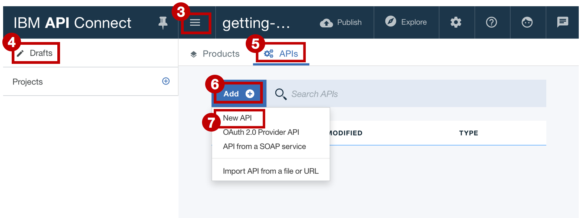
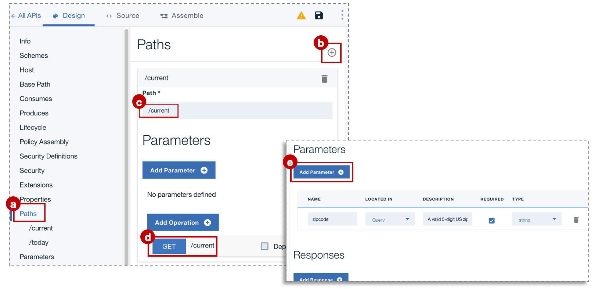
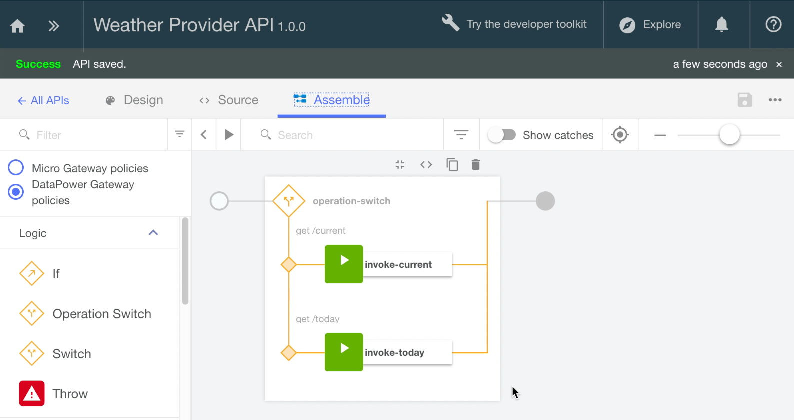
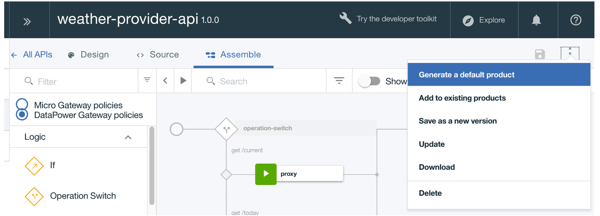

---
copyright:
  years: 2017
lastupdated: "2017-08-24"
---

{:new_window: target="blank"}
{:shortdesc: .shortdesc}
{:screen: .screen}
{:codeblock: .codeblock}
{:pre: .pre}

# Add a new API spec and invoke an existing REST service with IBM Bluemix
**Duration**: 15 mins  
**Skill level**: Beginner  

## Objective
This tutorial helps you get started quickly with {{site.data.keyword.apiconnect_full}}. We'll start by creating a new OpenAPI spec, and then create a passthrough API proxy for an existing REST service.

## Prerequisite
Before you begin, you need to [set up your API Connect Instance](tut_prereq_set_up_apic_instance.html).

---

### Explore the sample app and test the target endpoints
A sample _weather provider_ app was created for this tutorial.
1. To explore the app, go to [http://gettingstartedweatherapp.mybluemix.net/ ](http://gettingstartedweatherapp.mybluemix.net/){:new_window}.  
2. Enter a valid 5-digit U.S. zipcode to get the _**current weather**_ and _**today's forecast**_.  


3. The above sample weather app was built using APIs that provide the weather data. The endpoint to get the **current** weather data is _**https:// myweatherprovider<span></span>.mybluemix.net/current?zipcode={zipcode}**_. Test it out by visiting [https://myweatherprovider.mybluemix.net/current?zipcode=90210 ](https://myweatherprovider.mybluemix.net/current?zipcode=90210){:new_window}.  

  

4. Similarly, the Endpoint to get **today's** forecast data is _**https:// myweatherprovider<span></span>.mybluemix.net/today?zipcode={zipcode}**_. Test it out by going to [https://myweatherprovider.mybluemix.net/today?zipcode=90210 ](https://myweatherprovider.mybluemix.net/today?zipcode=90210){:new_window}.  

  


---

### Add a new OpenAPI spec to create a REST API proxy  
1. Log in to {{site.data.keyword.Bluemix_short}}: https://new-console.ng.bluemix.net/login.
2. In the {{site.data.keyword.Bluemix_short}} navigation panel, select **Services**, then select **Dashboard**. Launch the {{site.data.keyword.apiconnect_short}} service.
3. In {{site.data.keyword.apiconnect_short}}, make sure the navigation panel is open. If not, click **>>** to open it.  
4. Select **Drafts** in the navigation panel.
5. In the **APIs** tab, click **Add**. From the dropdown menu, select **New API**.    
    
6. In the *New API* window, enter ```Weather Provider API``` for the title.
_The Name and Base Path are auto-populated_.  
  
7. Click **Create API** to complete the wizard.  
8. After you create your API, the **Design** tab is selected. 
9. Scroll to the **Host** panel. Enter ```$(catalog.host)``` as the value if the field is not automatically filled in.
10. In the **Base Path** panel, note the auto-populated value: ```/weather-provider-api```. Your API's target URL will be created from these values.  

11. Scroll to the **Security** tab, and delete the "clientIDHeader (API Key)" that has been been auto-generated.  
_(We'll visit security with API Keys in the next tutorial.)_  

12. In the navigation, scroll down to the **Paths** panel and create a new path by clicking **+**.     
    a. Name the new path "**/current**".  
    b. In the same *Paths* panel, select the **GET /current** section.    
    c. In the **GET /current** section, add a new **Parameter**. As you noticed while exploring the sample app, the weather service requires zipcode as a parameter.   
      - Name: zipcode  
      - Located in: Query  
      - Required: Yes  
      - Type: string   
       
    d. Save your API.  

13. With your query parameters defined in the previous step, you now need to define the response object that is returned when you invoke the weather API. To do so, scroll down to the **Definitions** panel.   
    a. Add a new definition.  
    b. Name the new definition _Current_.  
    c. Set the Type to _Object_.  
    d. Add new properties for the **Current** definition.    
       - Name: zip         /  Type: string   
       - Name: temperature /  Type: integer   
       - Name: humidity    /  Type: integer   
       - Name: city        /  Type: string   
       - Name: state       /  Type: string   
       
    e. Save your API.  

14. In the previous step, you defined the response object. Next you'll need to ensure the response object is associated with the **get /current** path. In the navigation, scroll back up to the **Paths** panel.
    a. Open the **GET /current** operation, and scroll to the **Responses** section.
    b. Change the schema of the 200OK response from "object" to "**Current**".
    c. Save your API by clicking the save icon. An “API Saved” confirmation notification appears momentarily. 

15. The path and operation just created was to get the current weather data. Now you'll need to create a similar path and operation to get today's weather data. Similar to how you created the **/current** path in step 12, create a new path: **/today**.

16. Add a new Parameter under the **GET /today** operation.
    - Parameter Name: zipcode  
    - Located in: Query  
    - Required: Yes  
    - Type: string  

17. Create a new definition: **Today**.

18. Add new properties for the **Today** definition.
    - Name: zip / Type: string
    - Name: hi / Type: integer
    - Name: lo / Type: integer
    - Name: nightHumidity / Type: integer
    - Name: dayHumidity / Type: integer
    - Name: city / Type: string
    - Name: state / Type: string
19. Update the response schema in the **GET /today** section to "Today".
20. Save your API.

21. Switch over to the **Assemble** tab. You created two operations so far: **GET /current** and **GET /today**. To ensure the correct target endpoint is invoked, you'll need to create some logic that will execute conditional on the operation that's being called. Let's use the **Operation Switch** logic construct to do this.  
    a. Delete the **invoke** policy that may already be added to the _canvas_.  
    b. From the palette, drag the **Operation Switch** and drop it on the canvas.  
      - To **case 0**, assign the **get /current** operation.
      - Add a new Case: **case 1**.
      - Assign the **get /today** operation to **case 1**.
      
The **Operation Switch** provides a decision point. Based on the verb/path pair, the appropriate operation needs to be invoked.
    c. Drag the **invoke** policy from the palette and drop it on the canvas. _The invoke action is used to call an existing service from within an operation_.  Drop an invoke action in the **/get current** path, and one in the **/get today** path.   
    d. Select the **invoke** policy in the **/get current** path, and update its title to "**invoke-current**".  
    e. Update the URL field with ```https://myweatherprovider.mybluemix.net/current?zipcode=$(request.parameters.zipcode)```.  
    f. Select the **invoke** policy in the **/get today** path, and update its title to "**invoke-today**".  
    g. Update the URL field with ```https://myweatherprovider.mybluemix.net/today?zipcode=$(request.parameters.zipcode)```.  
       

22. Save your API.

---

### Test your API proxy
1. In the **Assemble** tab, click the icon for more actions, then select **Generate a default product**.  
    

2. Accept the default options in the **New Product** dialog box, and click **Create Product**. The Weather Provider API product is created and published to the Sandbox catalog. A message indicating successful product generation is displayed.  
    
  
   

  - _In {{site.data.keyword.apiconnect_short}}, **Products** provide a way to group APIs that are intended for a particular use. Products are published to a **Catalog**. [{{site.data.keyword.apiconnect_short}} glossary](../apic_glossary.html)_

3. In the Assemble tab, click the play icon to test your API proxy's target invocation.

4. In the test panel, select the **get /current** operation.
	a. Zipcode is a required parameter for this operation, so enter a valid U.S. zip code (e.g. 90210). 
	b. Click **invoke**, and verify that you see: 
  ```
  200 OK response
  Current weather data for 90210  
  ```
  
      

      

    

---

### Conclusion
In this tutorial, you learned how an existing REST service can be invoked through an API passthrough proxy. You started by checking the availability of the sample service through the web browser. Then you created a new OpenAPI spec in API Connect, and linked it to the sample service to be invoked. You packaged your API into a product, published the product to catalog, and tested the proxy.
