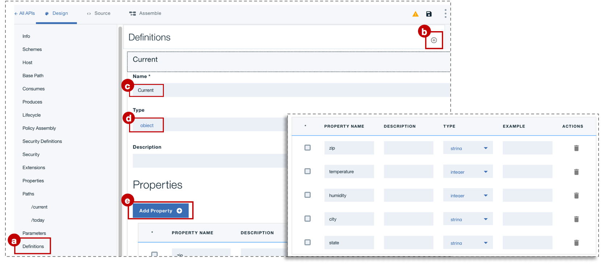
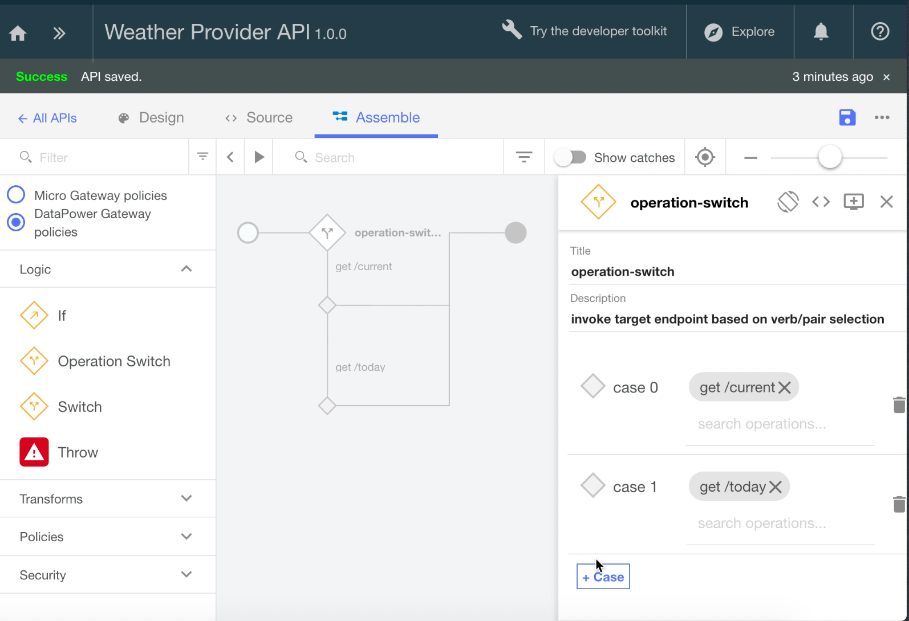
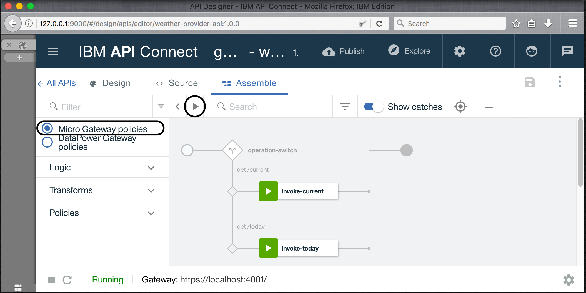
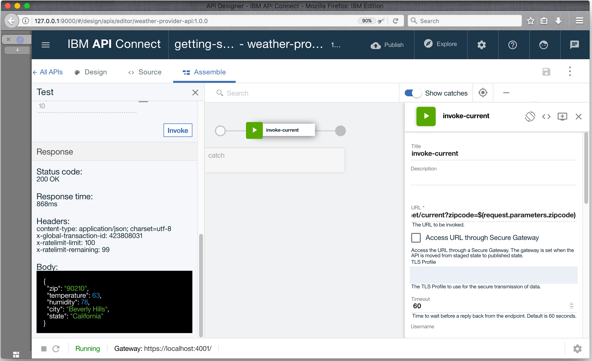
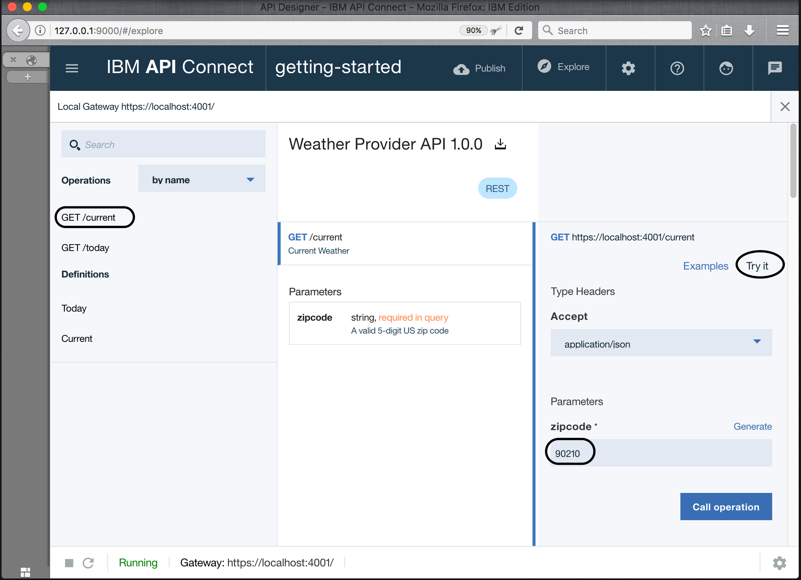

---
copyright:
  years: 2017
lastupdated: "2017-09-30"
---

{:new_window: target="blank"}
{:shortdesc: .shortdesc}
{:screen: .screen}
{:codeblock: .codeblock}
{:pre: .pre}

# Add a new API spec and invoke an existing REST service using the Developer Toolkit
**Duration**: 15 mins  
**Skill level**: Beginner  

## Objective
This tutorial helps you get started quickly with {{site.data.keyword.apiconnect_short}} by illustrating how you can bring your existing API under management control. You'll start by creating a new OpenAPI spec, and then create a passthrough API proxy for an existing REST service.

## Prerequisite
Before you begin, you will need to [set up your API Connect Instance](tut_prereq_set_up_apic_instance.html) and [install the API Connect toolkit](tut_prereq_install_toolkit.html).

---


## Explore the sample app and test the target endpoints
A sample _weather provider_ app was created for this tutorial.
1. To explore the app, go to [http://gettingstartedweatherapp.mybluemix.net/ ](http://gettingstartedweatherapp.mybluemix.net/){:new_window}.  
2. Enter a valid 5-digit U.S. zipcode to get the _**current weather**_ and _**today's forecast**_.  


3. The above sample weather app was built using APIs that provide the weather data. The endpoint to get the **current** weather data is _**https:// myweatherprovider<span></span>.mybluemix.net/current?zipcode={zipcode}**_. Test it out by visiting [https://myweatherprovider.mybluemix.net/current?zipcode=90210 ](https://myweatherprovider.mybluemix.net/current?zipcode=90210){:new_window}.  

  

4. Similarly, the Endpoint to get **today's** forecast data is ```https:// myweatherprovider<span></span>.mybluemix.net/today?zipcode={zipcode}```. Test it out by going to [https://myweatherprovider.mybluemix.net/today?zipcode=90210 ](https://myweatherprovider.mybluemix.net/today?zipcode=90210){:new_window}.  

  

---

## Add a new OpenAPI spec and invoke an existing REST service
1. Launch the **API Designer**. In your terminal, enter `apic edit`.
2. Log in using your IBMid.
    
3.   In the API Designer, ensure the navigation panel is open. If not, click >> to open it. In the **API Designer** navigation panel, select **Drafts > APIs**.
4. In the **APIs** panel, select **Add > New API**.
5. In the New API window, enter "Weather Provider API" for the title. _The Name and Base Path are auto-populated_.  
     
6. Click **Create API** to complete the wizard.  

7. After your API is created, the **Design** tab is selected.

8. Scroll to the **Host** panel. Enter ```$(catalog.host)``` as the value if the field is not automatically filled in.

9. Scroll to the **Security** tab and delete the "clientIDHeader (API Key)" that has been been auto-generated.  
_(We'll visit security with API Keys in the next tutorial.)_  

10. In the **Paths** panel, create a new path by clicking **+**.
  a. Name the new path "**/current**".  
  b. In the same **Paths** panel, select the **GET /current** section.  
  c. In the **GET /current** section, add a new **Parameter**. As you noticed while exploring the sample app, the weather service requires zipcode as a parameter.
      - Name: zipcode  
      - Located in: Query  
      - Required: Yes  
      - Type: string  
    
  d. Save your API.

11. With your query parameters defined in the previous step, you need to now define the response object that is returned when you invoke the weather API. To do so, scroll down to the **Definitions** panel.

  1. Add a new definition. 
  2. Name the new definition _Current_.
  3. Set the Type of _Object_.
  4. Add new properties for the **Current** definition.
    - Name: zip         /  Type: string
    - Name: temperature /  Type: integer
    - Name: humidity    /  Type: integer
    - Name: city        /  Type: string
    - Name: state       /  Type: string
    
  5. Save your API.  

12. In the previous step, you defined the response object. Next you'll need to ensure the response object is associated with the **get /current** path. In the navigation, scroll back up to the **Paths** panel.
  a. Open the **GET /current** operation, and scroll to the **Responses** section.
  b. Change the schema of the 200OK response from "object" to "**Current**".
  c. Save your API.

13. The path and operation just created was to get the current weather data. Now you'll need to create a similar path and operation to get today's weather data. Similar to how you created the **/current** path in step 11, create a new path: **/today**. 

14. Add a new Parameter under the **GET /today** operation.
    - Parameter Name: zipcode  
    - Located in: Query  
    - Required: Yes  
    - Type: string  

15. Create a new definition: **Today**.

16. Add new properties for the **Today** definition.
  - Name: zip / Type: string
  - Name: hi / Type: integer
  - Name: lo / Type: integer
  - Name: nightHumidity / Type: integer
  - Name: dayHumidity / Type: integer
  - Name: city / Type: string
  - Name: state / Type: string

17. Update the response schema in the **GET /today** section to "Today".

18. Save your API.

19. Switch over to the **Assemble** tab. You created two operations so far: **GET /current** and **GET /today**. To ensure the right target endpoint is invoked, you'll need to create some logic that will execute conditional on the operation that's being called. Let's use the **Operation Switch** logic construct to do this.  

    a. Delete the **invoke** policy that may already be added to the _canvas_.  
    b. From the _palette_, drag the **Operation Switch** and drop it on the canvas.  
      - To **case 0**, assign the **get /current** operation.
      - Add a new Case: **case 1**.
      - Assign the **get /today** operation to **case 1**.
    
    The **Operation Switch** provides a decision point. Based on the verb/path pair, the appropriate operation must be invoked.  
    c. Drag the **invoke** policy from the palette and drop it on the canvas. Drop one in the **/get current** path and one in the **/get today** path.
    d. Select the **invoke** policy in the **/get current** path, and update its title to "**invoke-current**".  
    e. Update the URL field with: ```https:// myweatherprovider<span></span>.mybluemix.net/current?zipcode=$(request.parameters.zipcode)```.
    f. Select the **invoke** policy in the **/get today** path, and update its title to "**invoke-today**".  
    g. Update the URL field with: ```https:// myweatherprovider<span></span>.mybluemix.net/today?zipcode=$(request.parameters.zipcode)```.  

20. Save your API.

---

## Test your API proxy

### Test with the _API Manager test tool_.
1. Start the local test server by clicking the start servers icon (>) on the bottom left of the designer. Once the Gateway is started, you will see the status automatically update to Running.

    

2. In the **Assemble** tab, click the play icon (>) to test your API proxy’s target invocation. _For this tutorial, we shall use the embedded Micro Gateway, so ensure Micro Gateway Policies is selected._

    

3. In the test panel, select the **get /current** operation.  
  a. Zipcode is a required parameter for this operation, so enter a valid U.S. zip code (for example, 90210).  
  b. Click **invoke**, and verify that you see:
  ```
  200 OK response
  Current weather data for 90210  
  ```
      

_If you run into a CORS error, follow the instructions in the error message. Click the link in the error to add the exception to your browser, and then hit the "invoke" button again._

### Test with the _Explore tool_.  
1. To test your API proxy endpoints, select _Explore_.
2. Select the **GET /current** operation from the palette.
3. Enter a valid U.S. zipcode (e.g. 90210) in the test box.
4. Click **Call operation** to see the response.  
    
  
---

## Conclusion
In this tutorial, you saw how an existing REST service can be invoked through an API passthrough proxy. You started by checking the availability of the sample service through the web browser. Then you created a new OpenAPI spec in {{site.data.keyword.apiconnect_short}}, and linked it to the sample service to be invoked. Finally, you tested the API proxy with the built-in testing tool.

---

## Next step

Secure your API using [rate limiting](tut_rate_limit.html), [client ID and secret](tut_secure_landing.html), or [securing using OAuth 2.0](tut_secure_oauth_2.html).

Create > **Manage** > Secure > Socialize > Analyze

