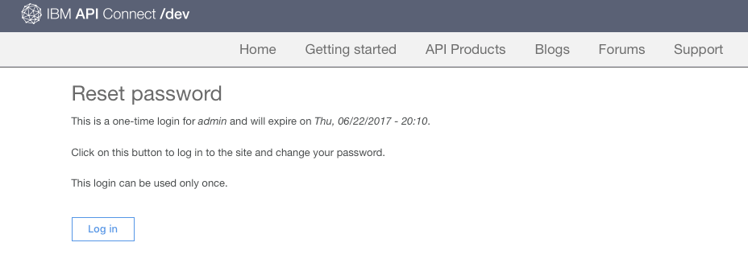
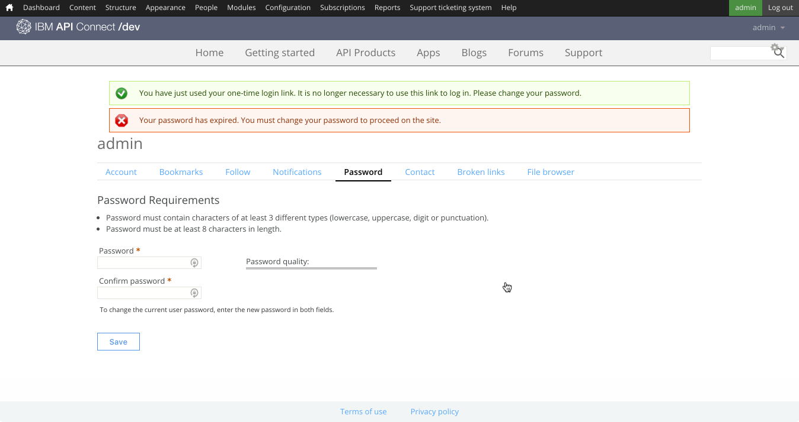

---
copyright:
  years: 2017
lastupdated: "2017-09-12"
---

{:new_window: target="blank"}
{:shortdesc: .shortdesc}
{:screen: .screen}
{:codeblock: .codeblock}
{:pre: .pre}

# Setting up and configuring your Developer Portal
**Duration**: 30 mins  
**Skill level**: Beginner  

## Prerequisites
Before you begin, you will need to [import your API spec and proxy an existing REST service](tut_rest_landing.html).

## Objective
This tutorial will help you quickly get started with configuring your **API Connect Developer Portal**. 

---

## Create your developer portal
In this section, you will create a developer portal for a catalog.

*Catalogs* are an IBM term for different environments. For example, you would create different catalogs for your testing, staging, and production enviornments. You should have a catalog called Sandbox. Feel free to use this catalog to create your developer portal, or create a new catalog and name it whatever you want.

1. In your Bluemix dashboard, select your **API Connect** service to launch the API Connect dashboard.

2. In the API Connect dashboard, select the catalog for which you want to create a developer portal. For example, **Sandbox**.

3. In the catalog, select the **Settings** tab.  
  

4. In the Settings tab, select **Portal**.  
  

5. On the Portal Configuration page, select **IBM Developer Portal** from the Select Portal dropdown. 
   

6. Take note of your **Portal URL**, then save your changes.  
  
  
7. As noted in the dialog box, it typically takes a few minutes to create your developer portal. You will receive an email when it has finished. Select **OK** to acknowledge the dialog message.  
  

---

## Explore your developer portal
In this section, you will get acquainted with the developer portal you created in the previous steps.

1. After you have configured the developer portal for your catalog, you will receive an email with a link to a one-time login. Select the link to launch the developer portal.

2. Select **Login** to log in to the developer portal. 

3. Enter a new password and click **Save**.  
  

4. Now that you've set your password, let's explore the developer portal, starting with **Home** at the top of the page.  
  
  
| Tab              | Description          | 
|:---------------- | -------------------- | 
| _Home_       | The Home page is the welcome page to your developer portal. You can [customize the page](tut_custom_dev_portal.html) to suit your needs. | 
| _Getting Started_       | The Getting started page is used to instruct developers how to get started using your developer portal. |
| _API Products_ | The API Products page is used by developers to explore and subscribe to the APIs that are available on your portal. | 
| _Apps_ | The Apps page displays the applications that are using your APIs. | 
| _Blogs_ | The Blogs page is where you can create and display blog posts about your APIs. | 
| _Forums_ | The Forums page is where developers can have discussions and post questions about your APIs. | 
| _Support_ | The Support page is where you can direct developers on how they can receive support on your APIs. For example, you can refer them to your forums and FAQs. You can also provide a link that allows them to open a support ticket if needed. | 

Note: On the API Products page, you can select one of the products to view the Product page for an API and the available plans. It enables developers to subscribe to and view the API details. 

  

### Conclusion
In this tutorial, you learned how to set up and configure your API Connect Developer Portal. You also explored the developer portal.

---

## Next step

[Customize your Developer Portal and select a theme](tut_custom_dev_portal.html).

Create > Manage > Secure > **Socialize** > Analyze