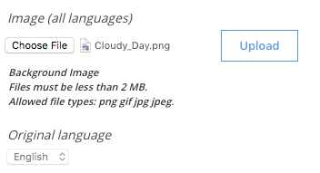
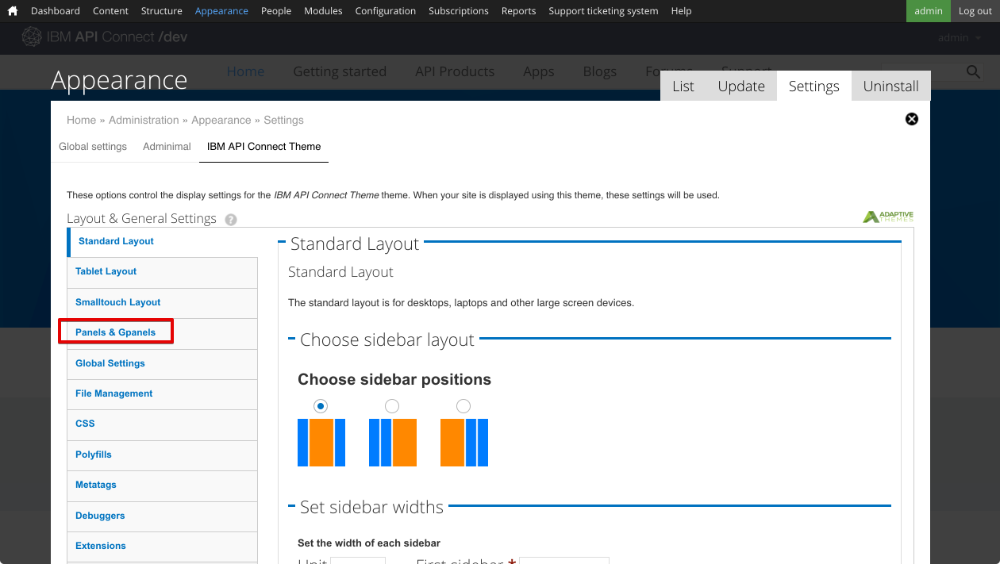
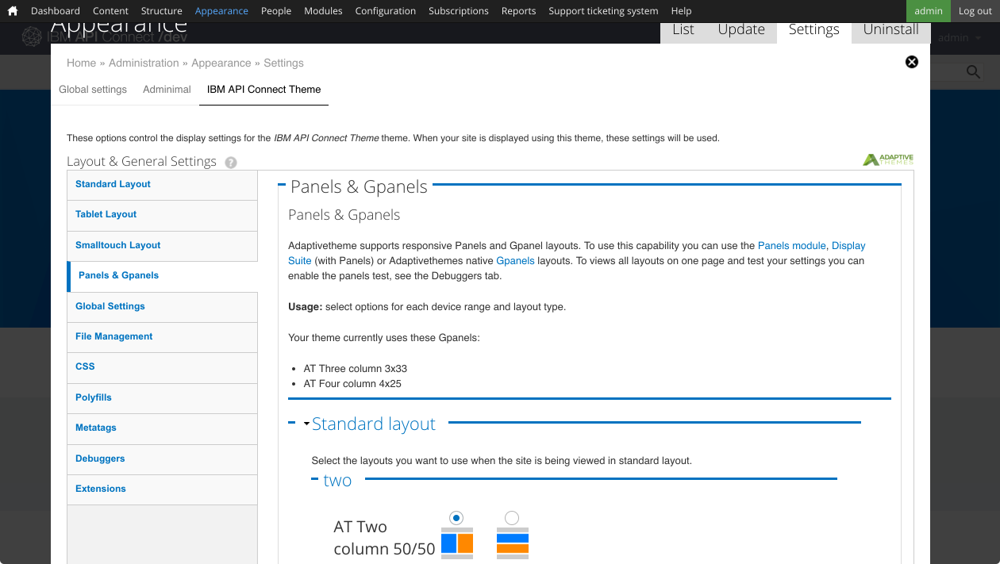
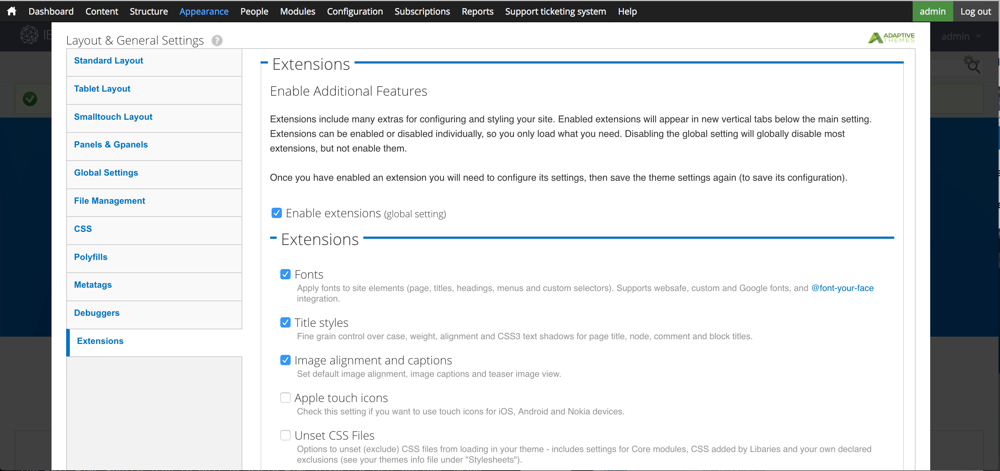
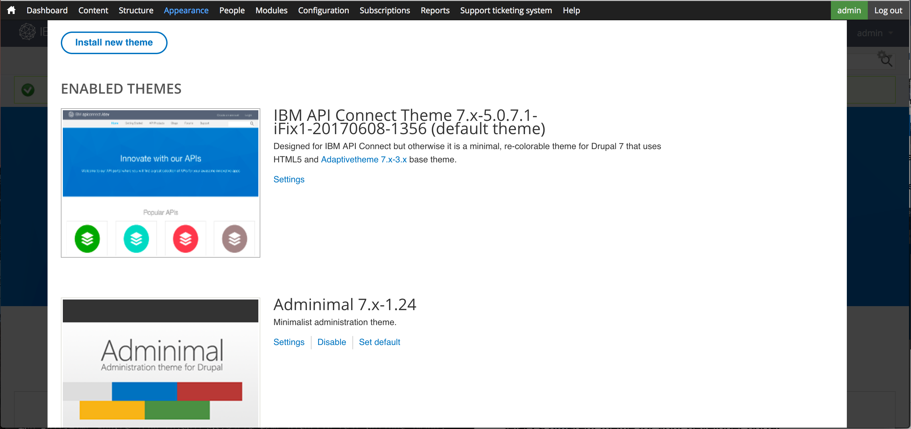
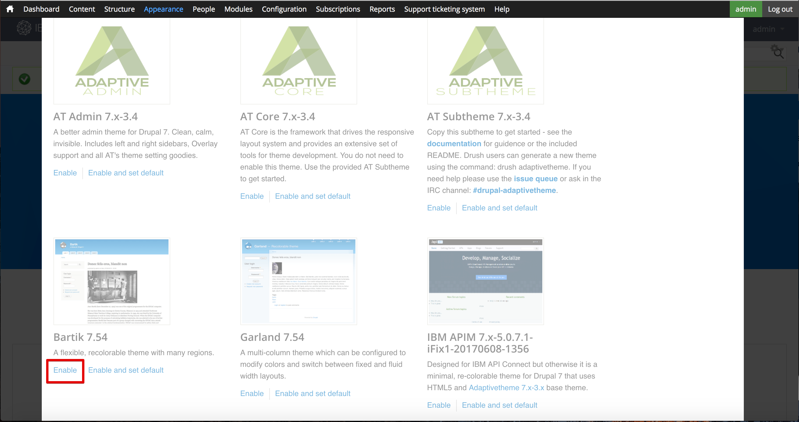
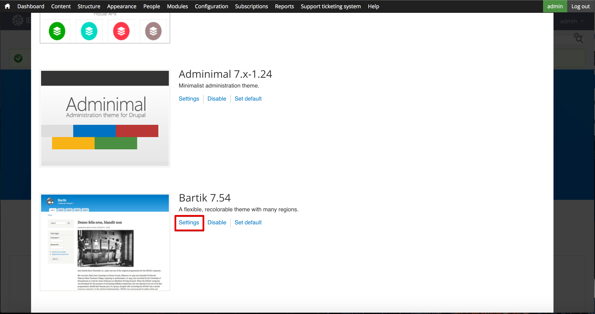
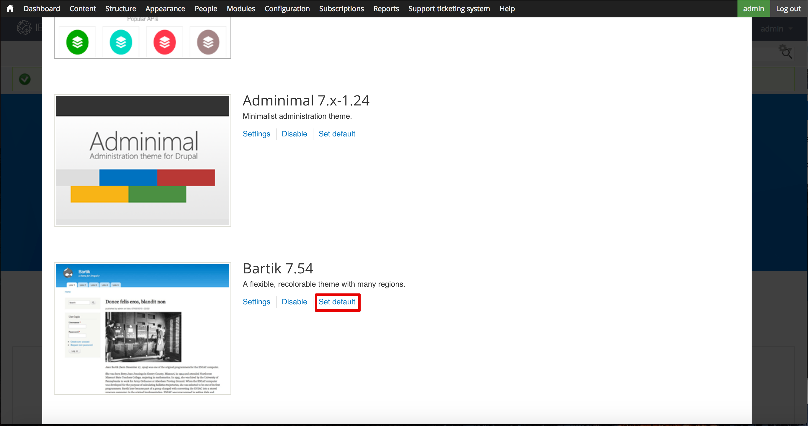
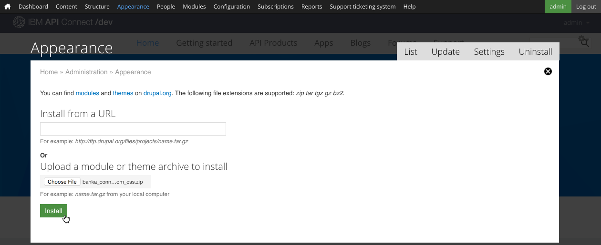
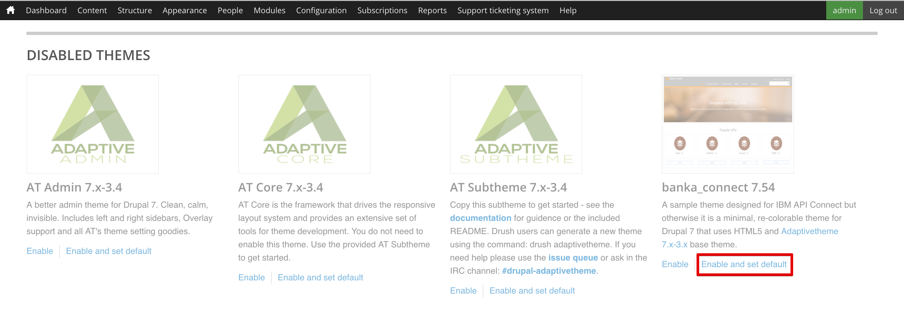

---
copyright:
  years: 2017
lastupdated: "2017-10-31"
---

{:new_window: target="blank"}
{:shortdesc: .shortdesc}
{:screen: .screen}
{:codeblock: .codeblock}
{:pre: .pre}

# Customizing your Developer Portal and selecting a theme
{: #tut_custom_dev_portal}

**Duration**: 30 mins  
**Skill level**: Beginner  

## Objective
{: #object_tut_custom_dev_portal}

This tutorial will help you quickly customize your {{site.data.keyword.apiconnect_full}} Developer Portal and select a theme that suits your needs.

---

## Prerequisites
{: #prereq_tut_custom_dev_portal}

Before starting this tutorial, you should have completed the [Setting up and configuring your Developer Portal](/docs/services/apiconnect/tut_config_dev_portal.html) tutorial and be logged in as the portal administrator.

---

## Customize your developer portal
{: #cust_tut_custom_dev_portal}

After you have created your developer portal, you can customize its look and feel.

1. Let's begin by modifying the Welcome Banner. In the top menu select **Content**, then select **Blocks**.  
  

2. Select **Edit** in the **Welcome Banner** block.  
  

3. Under the Content heading, you can change the Content text and image for the Welcome banner by either entering text into the content editor, or selecting the Edit HTML Source icon to edit or paste HTML directly that defines image and text specifications.  
   

4. Let's also add an image to our home screen. Scroll down to the Image heading. Find an image to use for your background and save it in the appropriate file format (png, gif, jpg, jpeg). If you don't have an image, you can use [this one](images/Cloudy_Day.png). Click **Choose File** and browse for your chosen background image. After you have selected the image, click **Upload**.  
  

5. The image will be displayed once it has been uploaded. If you want to remove it, click **Remove**.  
  
 
6. At the bottom of the page, click **Save** to save your changes.  
  
---

## Customize the theme for your developer portal
{: #cust_theme_tut_custom_dev_portal}

The developer portal allows you to modify the theme to change its look and feel.

1. To modify the theme, select **Appearance** from the top menu, then select **Settings** and then **IBM API Connect Theme**. This is the default theme when you created your developer portal.
   

2. The **Standard Layout** tab allows you to modify the layouts for devices with large screens, such as desktops. The **Tablet Layout** tab allows you to modify the layouts used on tablet devices. The **Smalltouch Layout** tab allows you to modify the layouts used on devices such as smartphones. After inspecting these tabs, select **Panels & Gpanels**. 
  

3. In addition to modifying the Sidebar layouts above, the default theme supports the use of Gpanels, or Responsive Panels, if you install the Panels module. To control the panels layout on standard, tablet, and smalltouch devices, expand the sections and update the settings. 
   

4. There are other settings that you can adjust, but let's skip down and select **Extensions**. This tab allows you to enable additional settings you can use to configure the styling of your developer portal.  
  

5. The settings of the extensions enabled on the **Extensions** tab can be modified in the **Extensions** section below the main settings.     
  

6. After the settings modifications are complete, select **Save configuration** at the bottom of the page.

---

## Select a different theme for your developer portal
{: #diff_theme_tut_custom_dev_portal}

The developer portal comes with additional themes for you to choose from and customize to change its look and feel.

1. To enable a different theme, select the **List** tab at the top of the Appearance settings.
   

2. At the top of the **Lists** tab, the enabled themes are displayed. 
  

3. Below the list of enabled themes are a collection of disabled themes. You can enable a theme by selecting **Enable**   
   

4. After the theme is enabled, it will appear at the top of the **List** tab in the **Enabled Themes**. You can customize it by selecting **Settings**.  
  

5. After you are done modifying the settings, you can set the theme as the default by selecting **Set Default**.     
  

---

## Install a new theme for your developer portal
{: #new_theme_tut_custom_dev_portal}

If modifying an existing theme doesn't suit your needs, the Developer portal also allows you to install a theme to change its look and feel.

1. You can use modules or themes downloaded from [drupal.org ](http://drupal.org){: #new_window} to customize your developer portal or you can create your own.

2. To install a theme into the developer portal, select **Appearance** from the top menu, then select **Install new theme**.  
  

3. You can install themes directly from [drupal.org ](http://drupal.org){: #new_window} using a URL, or you can upload a theme you downloaded or created by clicking **Choose File**, then **Install**.  
   

4. When the upload completes, you need to enable the theme. Select **Enable newly added themes**.  
  

5. Scroll down in the list and find the newly installed theme. Select **Enable and set default**.  
  

6. At the bottom of the page, click **Save** to save your changes.  

---

## Conclusion
{: #conclusion_tut_custom_dev_portal}
Congratulations, you have completed this tutorial. In this tutorial you learned how to:

* Customize your developer portal welcome page
* Customize the theme used by your developer portal 
* Select a different theme to use for your developer portal
* Install a new theme for your developer portal

---

## Next step
{: #next_tut_custom_dev_portal}

Learn [how a user navigates through a Developer Portal](/docs/services/apiconnect/tutorials/tut_discover_apis.html) or [how to gain insights from basic analytics](/docs/services/apiconnect/tutorials/tut_insights_analytics.html).

Create > Manage > Secure > **Socialize** > Analyze  

