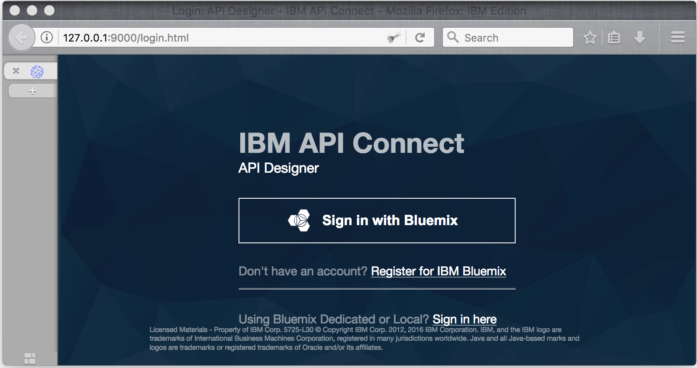
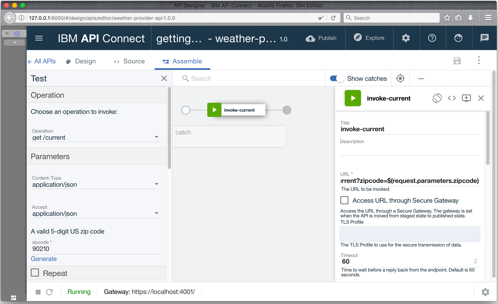

copyright:
  years: 2017
lastupdated: "2017-10-31"

subcollection: apiconnect

keywords: IBM Cloud, APIs, lifecycle, catalog, manage, toolkit, develop, dev portal, tutorial

---

{:new_window: target="blank"}
{:shortdesc: .shortdesc}
{:screen: .screen}
{:codeblock: .codeblock}
{:pre: .pre}

# Import your API spec and proxy an existing REST service by using the Developer Toolkit
{: #tut_import_openapi_rest_tk}

Duration: 5 mins  
Skill level: Beginner  

## Objective
{: #object_tut_import_openapi_rest_tk}

This tutorial illustrates how you can bring your existing API under management control with {{site.data.keyword.apiconnect_full}}. In this tutorial, you will import an OpenAPI spec, and create a passthrough API proxy for an existing REST service.

## Prerequisites
{: #prereq_tut_import_openapi_rest_tk}

Before you begin, you will need to [set up your API Connect Instance](tut_prereq_set_up_apic_instance.html) and [install the API Connect toolkit](tut_prereq_install_toolkit.html).

---

## Explore the sample app and test the target endpoints
{: #explore_tut_import_openapi_rest_tk}

A sample _weather provider_ app has been created for this tutorial. The corresponding API specification (Swagger 2.0) is in the [weather-provider-api_1.yaml ](https://raw.githubusercontent.com/IBM-Bluemix-Docs/apiconnect/master/tutorials/weather-provider-api_1.yaml){: #new_window} file.

1. To explore the app, go to [http://gettingstartedweatherapp.mybluemix.net/ ](http://gettingstartedweatherapp.mybluemix.net/){: #new_window}.  
2. Enter a valid 5-digit U.S. zipcode to get the _**current weather**_ and _**today's forecast**_.  
S

3. The above sample weather app was built using APIs that provide the weather data. The endpoint to get the **current** weather data is `https://myweatherprovider.mybluemix.net/current?zipcode={zipcode}`. Test it out by visiting [https://myweatherprovider.mybluemix.net/current?zipcode=90210 ](https://myweatherprovider.mybluemix.net/current?zipcode=90210){: #new_window}.  

  

4. Similarly, the Endpoint to get **today's** forecast data is `https://myweatherprovider.mybluemix.net/today?zipcode={zipcode}`. Test it out by going to [https://myweatherprovider.mybluemix.net/today?zipcode=90210 ](https://myweatherprovider.mybluemix.net/today?zipcode=90210){: #new_window}.  

  

---

## Import the sample app's OpenAPI spec to create a REST API proxy
{: #import_tut_import_openapi_rest_tk}

1. Launch the **API Designer**. In your terminal window, enter the following command: `apic edit`.
2. Log in using your IBMid.
    
3. In the **API Designer**, ensure that the navigation panel is open. If not, click >> to open it.
4. In the navigation panel, click **Drafts**.
5. Go to the **APIs** tab.
6. In the APIs tab, click **Add**.
7. From the drop-down menu, click **Import API from a file or URL**.
   
8. There is an OpenAPI 2.0 definition of the weather API that you will use for this tutorial. In the "Import OpenAPI (Swagger)" dialog box, enter this URL:
`https://raw.githubusercontent.com/IBM-Bluemix-Docs/apiconnect/master/tutorials/weather-provider-api_1.yaml`.
9. Leave the _Add a product_ option unchecked and click **Import**.  
      

After you import the OpenAPI spec, you are taken to the Design view of the API. Here you can view various sections of the OpenAPI definition. Scroll to explore, and especially note the Host value. Also you can view the OpenAPI under the Source tab. 
_You'll see that the Host value is set to _ `$(catalog.host)` _. This is the base URL for your API proxy._
 

## Test your API proxy
{: #test_tut_import_openapi_rest_tk}

1. Start the local test server by selecting the **Start servers** icon. When the Gateway is started, you will see the status update automatically to _**Running**_.
    

2. Select the **Assemble** tab.

3. Click the play icon (>) to test your API proxy's target invocation.
   _For this tutorial, we will use the embedded Micro Gateway, so ensure **Micro Gateway Policies** is selected.
    

4. In the test panel:
  - Select the **get /current** operation.  
  - Zipcode is a required parameter for this operation, so enter a valid U.S. zip code (for example, 90210).  
  - Select **invoke**, and verify the response.

    _If you run into a CORS error, follow the instructions in the error message. Click the link in the error to add the exception to your browser, and then click **invoke** again.
  
  - The expected response is a **200 OK** response and the current weather data for zip code 90210.
        

## Conclusion
{: #conclusion_tut_import_openapi_rest_tk}

In this tutorial, you saw how an existing REST service can be invoked through an API passthrough proxy. You started by checking the availability of the sample service through the web browser. Then you created an API proxy in {{site.data.keyword.apiconnect_short}}, and linked the proxy to the sample service to be invoked. Finally, you tested this service with the {{site.data.keyword.apiconnect_short}} internal testing tools.

---

## Next step
{: #next_tut_import_openapi_rest_tk}

Secure your API using [rate limiting](/docs/services/apiconnect/tutorials?topic=tut_rate_limit), [client ID and secret](/docs/services/apiconnect/tutorials?topic=tut_secure_landing), or [securing using OAuth 2.0](/docs/services/apiconnect/tutorials?topic=tut_secure_oauth_2).

Create > **Manage** > Secure > Socialize > Analyze
