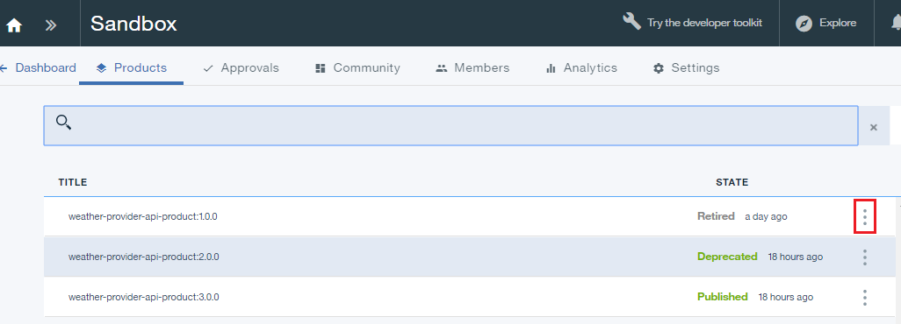
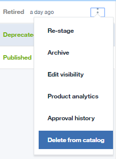
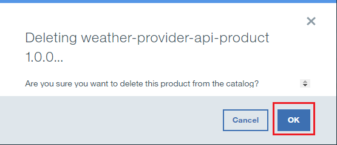
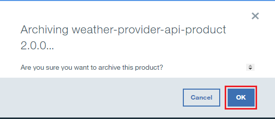
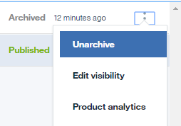

---

copyright:
  years: 2017
lastupdated: "2017-10-10"

subcollection: apiconnect

keywords: IBM Cloud, APIs, lifecycle, catalog, manage, toolkit, develop, dev portal, tutorial

---

{:new_window: target="_blank"}
{:shortdesc: .shortdesc}
{:screen: .screen}
{:codeblock: .codeblock}
{:pre: .pre}

# Archiving and deleting API Products
{: #tut_manage_remove}

**Duration**: 15 mins  
**Skill level**: Beginner 

## Objective
{: #object_tut_manage_remove}
In this tutorial, you will delete, archive, and retire an API.

---
## Prerequisites
{: #prereq_tut_manage_remove}

1. [Set up your {{site.data.keyword.apiconnect_full}} instance](/docs/services/apiconnect/tutorials?topic=tut_prereq_set_up_apic_instance).

2. Complete the [Supercede an API product tutorial](/docs/services/apiconnect/tutorials?topic=tut_manage_supercede).

---

## Deleting an API Product
{: #delete_tut_manage_remove}

1. Log in to {{site.data.keyword.Bluemix_short}}: [https://console.ng.bluemix.net/login ](https://console.ng.bluemix.net/login){: #new_window}.

2. In the {{site.data.keyword.Bluemix_short}} Dashboard, launch the {{site.data.keyword.apiconnect_short}} service.

3. In API Manager, if you have not previously pinned the UI navigation pane, click the **Navigate to** icon . The API Manager UI navigation pane opens. To pin the UI Navigation pane, click the **Pin menu** icon .

4. Click **Sandbox** to open the Sandbox catalog. **Note**: You may need to return to the Dashboard to see the available catalogs. Also, your dashboard page may show catalogs as tiles rather than a list.

5. Click the vertical ellipsis on the **Weather Provider API 1.0.0** line.  

6. Select **Delete from catalog**.  

7. Click **OK**.  

    The product disappears from the list of products in the catalog. It cannot be recovered at this point.

## Archiving an API Product
{: #archive_tut_manage_remove}

1. Click the vertical ellipsis on the **Weather Provider API 2.0.0** line.  

2. Select **Retire**.  

3. Click **OK**.  

4. Click the vertical ellipsis on the **Weather Provider API 2.0.0** line.  

5. Select **Archive**.  

6. Click **OK**.  

    The product disappears from the list of products in the catalog. It can be recovered.

7. Click the list view icon.  

8. Check **Archived**.  

9. Click the vertical ellipsis on the **Weather Provider API 2.0.0** line.  

10. Select **Unarchive**.  

    The product state changes to Retired.
    

 
 
## Conclusion
{: #conclusion_tut_manage_remove}

In this tutorial, you completed the following activities:

1. Deleted an API Product
2. Retired an API Product
3. Archived an API Product
4. Unarchived an API Product

---

