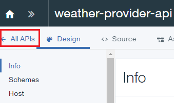
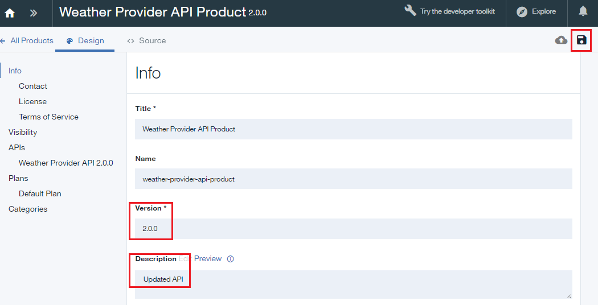
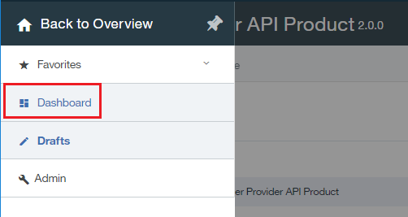
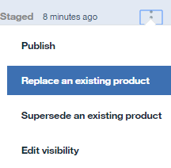
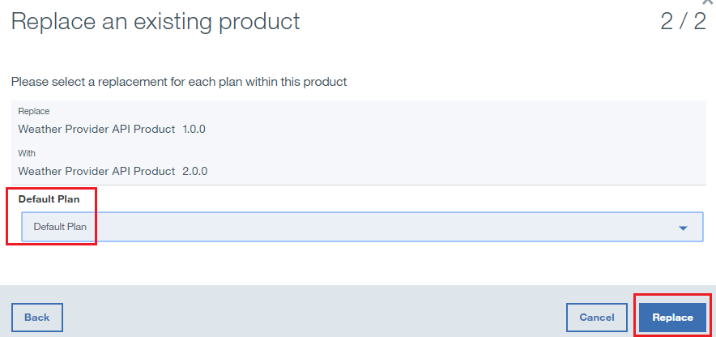

---

copyright:
  years: 2017
lastupdated: "2017-10-19"

---

{:new_window: target="_blank"}
{:shortdesc: .shortdesc}
{:screen: .screen}
{:codeblock: .codeblock}
{:pre: .pre}

# Replacing an API Product
**Duration**: 15 mins  
**Skill level**: Beginner  

## Prerequisites

1. [Set up your {{site.data.keyword.apiconnect_full}} instance](tut_prereq_set_up_apic_instance.html).

2. Complete one of the following tutorials:
 
    - [Import an OpenAPI2.0 spec and proxy an existing REST service](tut_rest_landing.html)
       **or**  
    - [Add a New API Spec and Invoke an Existing REST Service](tut_rest_landing.html).

---
## Objective
In this tutorial, you will update an existing API product by replacing it with a newer one. When an API product is replaced, the changes take effect immediately and all application subscriptions are updated automatically.  

---
## Replacing an API Product
{: #repl_api_prod}

1. Log in to {{site.data.keyword.Bluemix_short}}: [https://console.ng.bluemix.net/login ](https://console.ng.bluemix.net/login){:new_window}.

2. In the {{site.data.keyword.Bluemix_short}} Dashboard, launch the {{site.data.keyword.apiconnect_short}} service.

3. In API Manager, if you have not previously pinned the UI navigation pane, click the **Navigate to** icon . The API Manager UI navigation pane opens. To pin the UI Navigation pane, click the **Pin menu** icon .

4. Click **Drafts** > **APIs**.

5. In the APIs panel, click **Weather Provider API** to open the REST proxy API.  

6. Change the **Version** to 2.0.0.  

7. Click the disk icon to save the API changes.  

8. Click **All APIs**.  

9. Click **Products**.  

10.	Select **Weather Provider API Product**.  

11.	Change the **Version** to 2.0.0. Enter `Updated API` in the **Description** field. Click the disk icon to save the changes.  

12.	Click the **Stage** icon to upload the new version. Select the **Sandbox** catalog if it is not already selected.

    **Note**: It is possible to stage a new version to a different catalog, allowing control of what audience of developers can see this version. This capability can be helpful when moving API products from development to test to production.

13.	Click **>>** to open the navigation menu, and select **Dashboard**.  

14.	Click **Sandbox**.  

15.	Click the vertical ellipsis on the **Weather Provider API Product 2.0.0 Staged** line.  

16.	Select **Replace an existing product**.  

17.	Select **Weather Provider API Product 1.0.0** in the list of products presented. Click **Next**.  

18.	Select **Default plan**. Click **Replace**.  

    As a result of this replacement, the Weather Provider API Product 1.0.0 is retired, and the Weather Provider API Product 2.0.0  is published. **Note**: It is possible to change the plan associated with this product during the replacement process. This is an easy way to alter the plan for an API product.
  
 

## What you accomplished in this tutorial

In this tutorial, you completed the following activities:
1. Updated an API product.
2. Replaced an existing API product with an updated API product.

---

