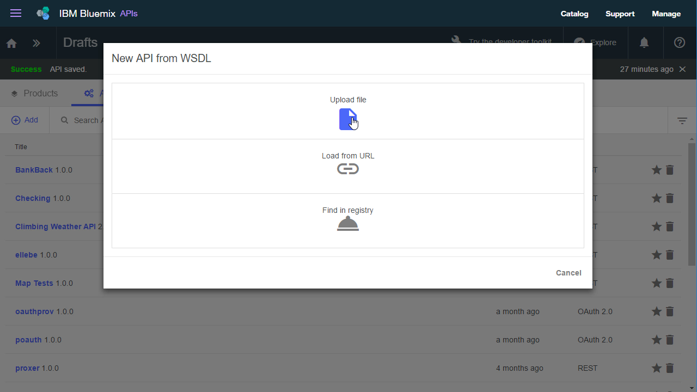
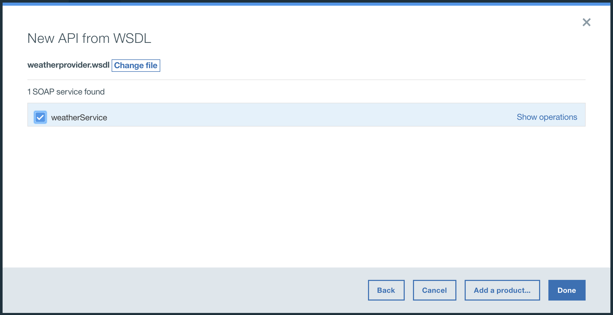
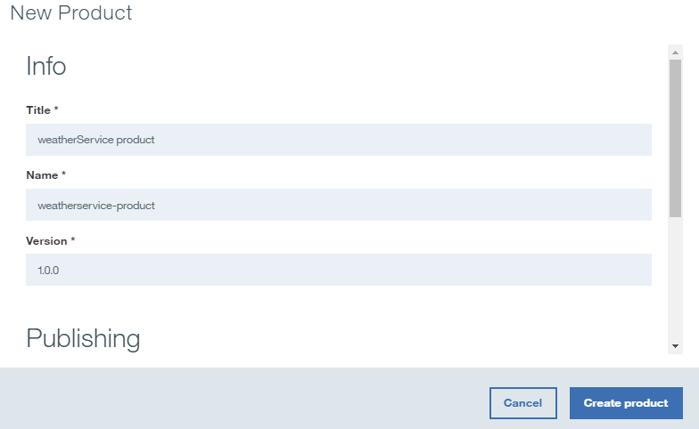
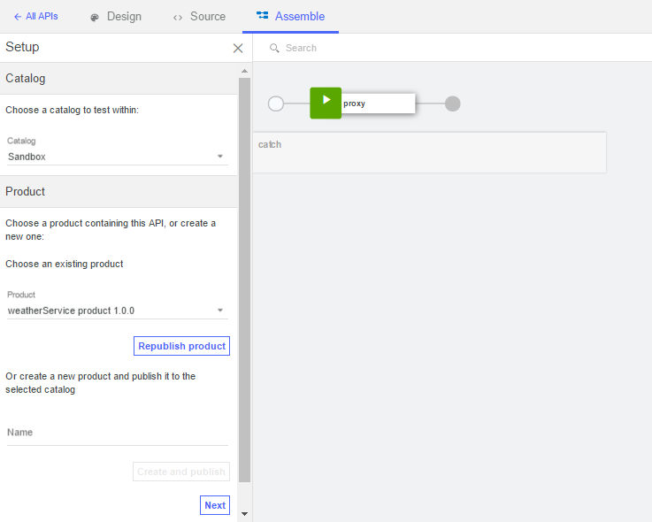
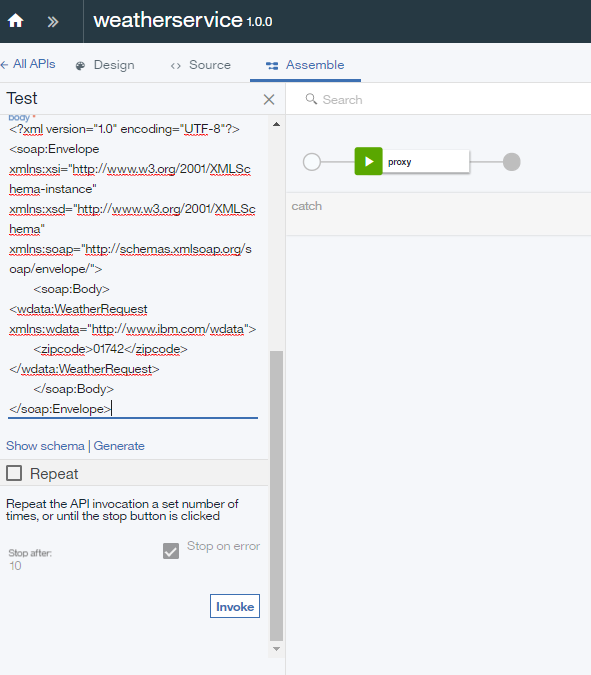
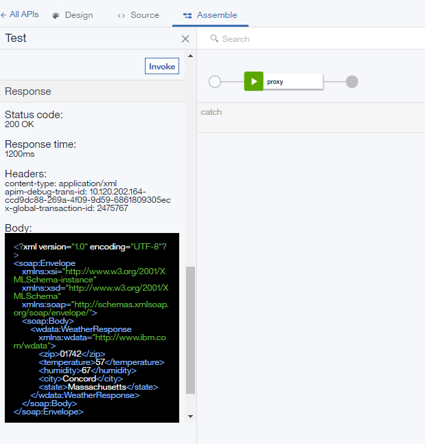

---
copyright:
  years: 2017
lastupdated: "2017-11-01"
---


{:new_window: target="_blank"}
{:shortdesc: .shortdesc}
{:screen: .screen}
{:codeblock: .codeblock}
{:pre: .pre}


# Managing a SOAP service
**Duration**: 15 mins
**Skill level**: Beginner

---
## Objective
In this tutorial, you will use API Manager to create a SOAP API that is a proxy for a SOAP-based weather service.

## Prerequisites
- Before you begin, you will need to [set up your {{site.data.keyword.apiconnect_short}} instance](tut_prereq_set_up_apic_instance.html).
- Before you begin, copy the [weatherprovider.wsdl test ](https://raw.githubusercontent.com/IBM-Bluemix-Docs/apiconnect/master/tutorials/weatherprovider.wsdl){:new_window} file to your local filesystem.
Note: You can click **Raw** and then save the resulting page on your local system as a `.wsdl` file. As the name suggests, this SOAP service returns weather data when given a zip code.

---
## Setting up a SOAP API definition
1. Log in to {{site.data.keyword.Bluemix_short}}: [https://new-console.ng.bluemix.net/login](https://new-console.ng.bluemix.net/login){:new_window}.

2. In the {{site.data.keyword.Bluemix_notm}} **Dashboard**, scroll down to **All Services**.

3. Select **API Connect** to launch the {{site.data.keyword.apiconnect_short}} service. 
  
4. Navigate to the Drafts page, if you are not already there:  
    a. In the {{site.data.keyword.apiconnect_short}} interface, click >> to open the navigation panel.
    b. Click **Drafts** in the navigation panel.
    c. Go to the **APIs** tab.

5. In the APIs tab, click `Add +`.

6. In the dropdown menu, select **API from a SOAP service**.
  

7. The New API from WSDL dialog box opens. Click **Upload File**.
  

8. Select the `weatherprovider.wsdl` file that you saved previously.

9. The New API from WSDL dialog box reappears. Check the **weatherService** check box. Click **Done**.
  

10. On successful import, you are taken to the Design view of the API. Also, you can view the OpenAPI definition under the Source tab.
   _In the Source tab, you will see that the WSDL is wrapped inside the OpenAPI definition._ 
  

11. Scroll down to the **Security tab**, and click the delete icon to remove the `clientIDHeader (API Key)` that was automatically generated when you created the service.
   _You will learn about security with API Keys in the next tutorial._

12. Click the  icon to save your changes. An "API Saved" confirmation notification appears momentarily.

13. In the menu bar with the save icon, the **Design** tab indicates your present location. Next to that, you find the **Source** tab where you can directly view the Swagger (2.0) file that represents your API, and next to that, you find the **Assemble** tab that takes you to a drag and drop interface for API processing. Click **Assemble**.
    

## Testing the SOAP API definition

1. In the **Assemble** tab, click the **More actions** (three dots) icon, and select **Generate a default product** from the menu.  
   

2. Accept the default options in the **New Product** dialog pop-up, and select **Create Product**. The **weatherService product 1.0.0** is created and published to the Sandbox catalog.  
  
 
  _In {{site.data.keyword.apiconnect_short}}, **Products** provides a mechanism to group APIs that are intended for a particular use. Products are published to a **Catalog**. Reference: [{{site.data.keyword.apiconnect_short}} glossary](../apic_glossary.html)_

3. Save your changes.  

4. Next to the Search box, click the test icon to test the API service. The Setup menu appears.

5. From the Products list, choose `weatherService product 1.0.0`.  
  

6. Scroll to the bottom and click **Next**.

7. From the list of Operations, select `post /weatherRequest`.  
  

8. Scroll down. Enter the following xml in the body field. You can select and copy the following example XML, then click the **body** field to activate the field and place the example XML.  
  ```
  <?xml version="1.0" encoding="UTF-8"?>
  <soap:Envelope xmlns:xsi="http://www.w3.org/2001/XMLSchema-instance" xmlns:xsd="http://www.w3.org/2001/XMLSchema" xmlns:soap="http://schemas.xmlsoap.org/soap/envelope/">
   <soap:Body>
  <wdata:WeatherRequest xmlns:wdata="http://www.ibm.com/wdata">
       <zipcode>10504</zipcode>
  </wdata:WeatherRequest>
   </soap:Body>
  </soap:Envelope>
  ```
  {: codeblock}  
  

9. Scroll down if needed, and click **Invoke**.
The API returns a Response **body** consisting of the current weather.  
  

## What you did in this tutorial
In this tutorial, you completed the following:
1. Set up a SOAP API definition
2. Tested your API definition
3. Received a Response **body** from the weather API endpoint indicating the result of your request.

---

## Next step

[Expose your service as a REST API](tut_expose_soap_api.html) or secure your API using [rate limiting](tut_rate_limit.html), [client ID and secret](tut_secure_landing.html), or [securing using OAuth 2.0](tut_secure_oauth_2.html).

Create > **Manage** > Secure > Socialize > Analyze
