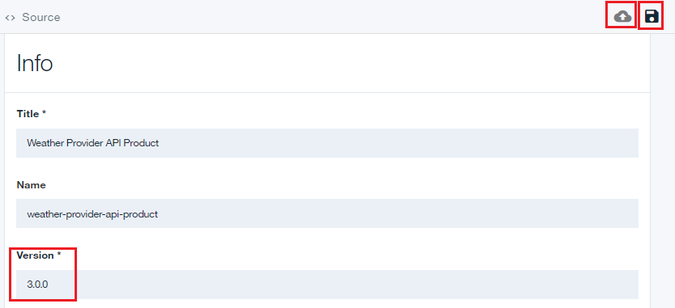
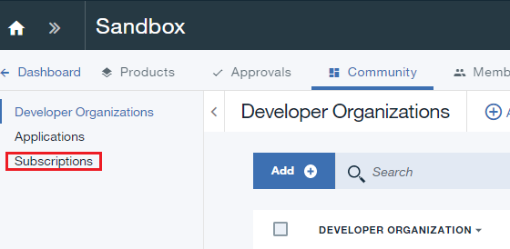
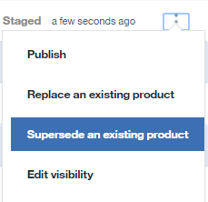
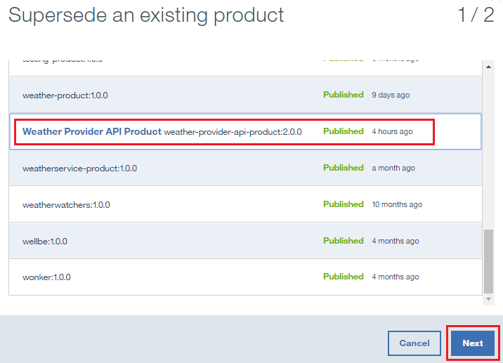
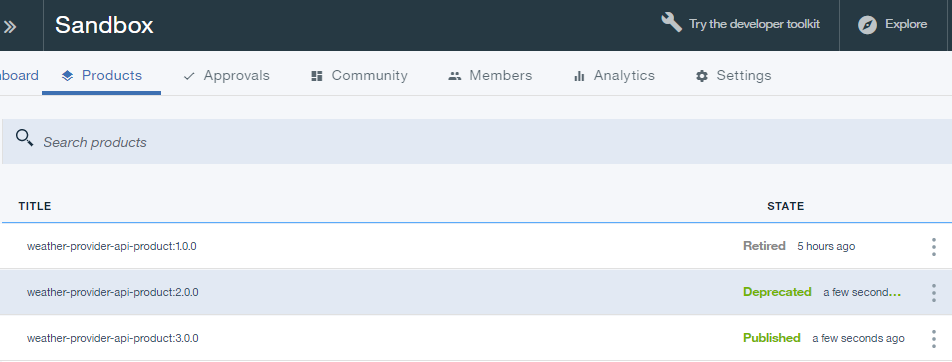

---

copyright:
  years: 2017
lastupdated: "2017-10-31"

---

{:new_window: target="_blank"}
{:shortdesc: .shortdesc}
{:screen: .screen}
{:codeblock: .codeblock}
{:pre: .pre}

# Superseding API Products
{: #tut_manage_supercede}

**Duration**: 15 mins  
**Skill level**: Beginner  

## Objective
{: #object_tut_manage_supercede}

In this tutorial, you will supersede an existing API with a new one.

---
## Prerequisites
{: #prereq_tut_manage_supercede}

1. [Set up your {{site.data.keyword.apiconnect_full}} instance](/docs/services/apiconnect/tutorials/tut_prereq_set_up_apic_instance.html).

2. Complete the [Replace an API product tutorial](/docs/services/apiconnect/tutorials/tut_manage_replace.html).

---

## Superceding an API Product
{: #super_tut_manage_supercede}

1. Log in to {{site.data.keyword.Bluemix_short}}: [https://console.ng.bluemix.net/login ](https://console.ng.bluemix.net/login){: #new_window}.

2. In the {{site.data.keyword.Bluemix_notm}} Dashboard, launch the {{site.data.keyword.apiconnect_short}} service.

3. In API Manager, if you have not previously pinned the UI navigation pane, click the **Navigate to** icon . The API Manager UI navigation pane opens. To pin the UI Navigation pane, click the **Pin menu** icon .

4. Click **Sandbox** to open the Sandbox catalog. **Note**: Your screen may show tiles rather than a list of catalogs.

4. Click **Drafts** > **APIs**.

5. In the APIs panel, click **Weather Provider API** to open the REST proxy API.  

6. Change the **Version** to 3.0.0.

7. Click the disk icon to save the API changes.  

8. Click **All APIs**.  

9. Click **Products**.  

10.	Select **Weather Provider API Product 2.0.0**.  

11.	Change the **Version** to 3.0.0. Click the disk icon to save the changes. Click the **Stage** icon.  

12.	Click **>>** to open the navigation pane, then select **Dashboard**.  

13.	Click **Sandbox**.

14.	Click **Community**.  

15.	Click **Subscriptions**.  

16.	Note the application subscriptions to Weather Provider API Product 2.0.0. Click **Products**.
  

17.	Click the vertical ellipsis on the **Weather Provider API Product 3.0.0 Staged** line.  

18.	Select **Supersede an existing product**.  

19.	Select **Weather Provider API Product 2.0.0** in the list of products presented. Click **Next**.  

20.	Select **Default plan**. Click **Supercede**.  

    As a result of this replacement, the Weather Provider API Product 2.0.0 is deprecated, and the Weather Provider API Product 3.0.0 is published.  
 
 
21.	Click **Community >> Subscriptions**.  

 
22.	Click the vertical ellipsis on the **Weather Provider API Product 2.0.0** line. Select **Manage**.  
 

23.	Select **Default plan** under Weather Provider API Product 3.0.0 . Click **Migrate**.  

    As a result of this migration, the Weather Provider API Product 2.0.0 is migrated to Weather Provider API Product 3.0.0.  
 
 

 
## Conclusion
{: #conclusion_tut_manage_supercede}

In this tutorial, you completed the following activities:

1. Updated an API product.
2. Superceded an existing API product with an updated API Product.
3. Migrated the subscription to the existing API Product to the updated API Product.

---

