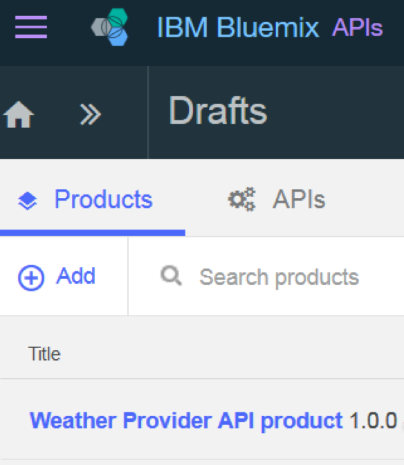
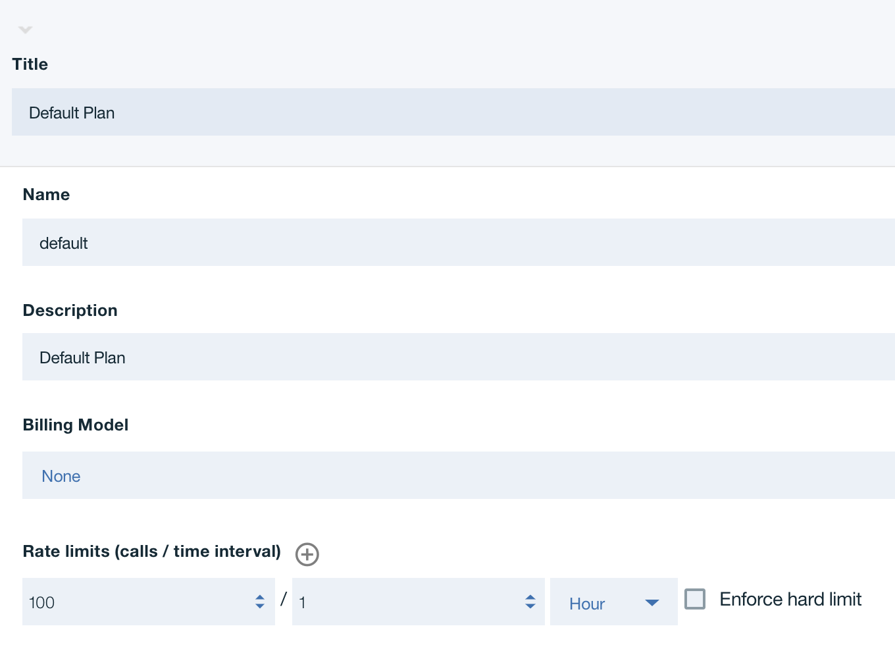
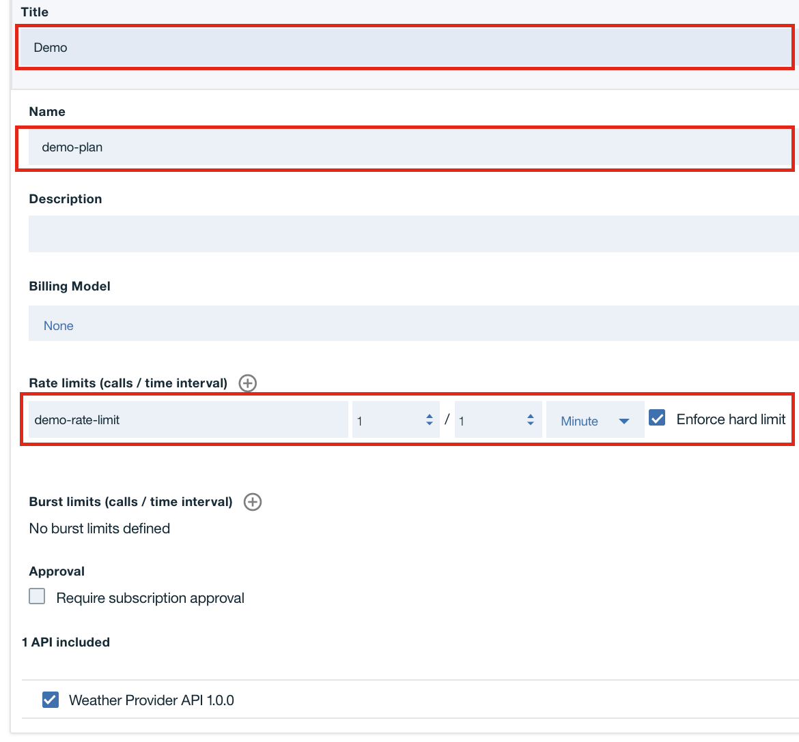
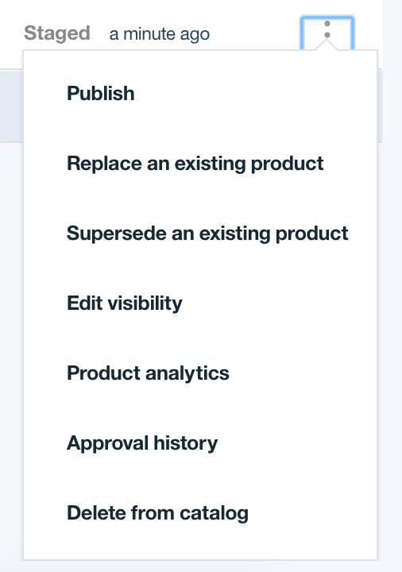
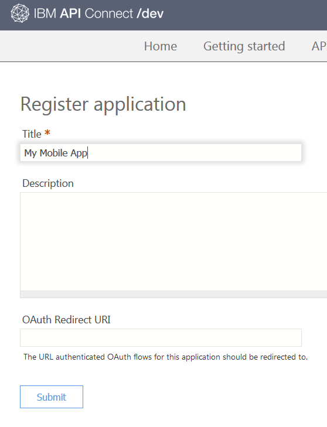
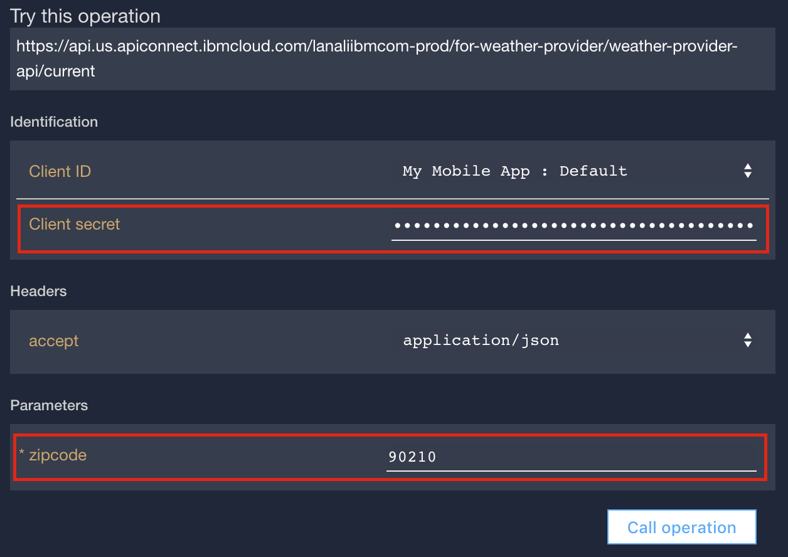
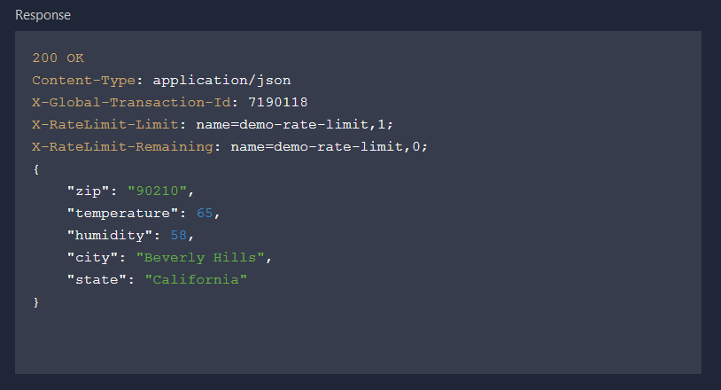
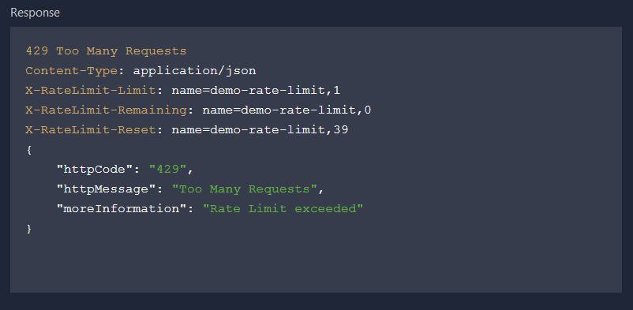

---
copyright:
  years: 2017
lastupdated: "2017-09-30"
---

{:new_window: target="blank"}
{:shortdesc: .shortdesc}
{:screen: .screen}
{:codeblock: .codeblock}
{:pre: .pre}

# Setting up rate limits
**Duration**: 15 mins  
**Skill level**: Beginner  

## Objective
This tutorial shows you how to rate limit your APIs. Setting rate limits enables you to manage the network traffic for your
APIs and for specific operations within your APIs. A rate limit is the maximum number of calls you want to allow in a particular time interval.

In {{site.data.keyword.apiconnect_full}}, *Products* provide a way of grouping APIs into a package for a particular use case or target audience. Products also contain *Plans*, which describe the terms that you are willing to offer to your API consumers. More precisely, Plans define rules associated with API subscriptions: API rate limits and whether the subscription needs to be approved.

When an application developer wants to use your APIs, they will select a Product that contains the API they wish to use, and subscribe to one of that Product's Plans, based on which Plan meets their usage needs.

In this tutorial, you will do the following:
1. Create a new rate-limited Plan in an existing Product.
2. See what happens when an application exceeds the allowed rate limits.

## Prerequisites
You must have already created an API in {{site.data.keyword.apiconnect_short}}, secured with at least an API Key. In the following instructions, our starting point is the [Weather Provider API example file ](https://raw.githubusercontent.com/ibm-apiconnect/getting-started/master/toolkit/1a-import/weather-provider-api_1.0.0.yaml){:new_window}, secured using a [client ID and secret](tut_secure_landing.html).

Complete the following tutorials before you start this tutorial:
- [Import your API spec, and proxy an existing REST service](tut_rest_landing.html).
- [Secure your API with a client ID and secret](tut_secure_landing.html).

---
## Launching API Connect

1. Log in to {{site.data.keyword.Bluemix_short}}: [https://console.ng.bluemix.net/login ](https://console.ng.bluemix.net/login){:new_window}.
2. Once logged in to {{site.data.keyword.Bluemix_short}}, scroll down to **All Services**, and click on **API Connect**.
3. Click on **API Connect** to launch the {{site.data.keyword.apiconnect_short}} service.

## Exploring the Default Plan
1. In the {{site.data.keyword.apiconnect_short}} navigation panel, select **Drafts**. (If the navigation panel is not open, click **>>** to open it.)
2. Select the **Products tab**, and you should see Weather Provider API product listed.

         

3. Click the Product link, and the Design view opens listing information about the Product.
4. Scroll down to the Plans section of the page. A Default Plan was created when you generated this Product. 

       
5. Expand the Default Plan details. Notice the rate limit (100 calls / 1 Hour) and API list, which can be expanded to show specific operations.

    

   
## Creating a new rate-limited Plan

Now that we have seen what the default Plan looks like, let's create a new Plan with more restrictive rate limits, to demonstrate what happens when an API consumer exceeds a Plan's limits. 
1. Click the button to add a new Plan.
 
     
    
    A new Plan is created for you, and by default, it is set to allow unlimited usage (that is, no rate limits at all). Let's give it a more meaningful name, and set a more restrictive limit. 
2. Click the new Plan (`New Plan 1`) to expand the details.
3. Click the Title field and set the Plan title to: `Demo`.
4. Click the Name field and set the Plan name to `demo-plan`.
5. Click + to add a new rate limit.
6. Rename the new rate limit to `demo-rate-limit`, and ensure it is set to `1 / 1 Minute`.
7. Check the `Enforce hard limit` checkbox. (When this setting is enabled, an application will receive an error if it calls an API more than allowed by the subscribed Plan limit).
8. Accept all the other default settings and save the Product.

    

## Staging & publishing an updated Product to the Sandbox Catalog

In previous examples, you may have published your Product using the test tool, which calls your API with a pre-supplied test application's credentials. However, this test application is not subject to rate limits, so we will need to create a new application here for rate limiting purposes. See the [IBM Knowledge Center content for API Connect ](https://www.ibm.com/support/knowledgecenter/SSFS6T/com.ibm.apic.toolkit.doc/tapim_create_product.html){:new_window} for more information.

1. Click the Publish icon to *stage* the Product to the **Sandbox** Catalog. This action adds your draft Product changes to the selected Catalog. We need to *publish* the Product changes next, to make them available to consumers via the Developer Portal.
    
2. Click the >> button to open the navigation menu.
    
3. Select Dashboard, then open the **Sandbox** Catalog. The Weather Provider API Product is listed as **Staged**.
4. Click the ellipsis, and select **Publish** from the menu.
    
5. Accept the default visibility settings and click the **Publish** button. Once the Product is published and made visible on the Developer Portal, application developers can subscribe to the available Plans.

## Registering a new (consumer) application in the Developer Portal
Application developers discover and use your APIs by using the Developer Portal. For more information on the Developer Portal, check out this [IBM Knowledge Center topic ](https://www.ibm.com/support/knowledgecenter/SSFS6T/com.ibm.apic.devportal.doc/tapim_tutorial_using_ADP.html){:new_window}.

If this is your first time working with the Developer Portal, you will need to provision a Developer Portal for your Sandbox Catalog. The account you are logged in as when you provision the Portal will be the admin account for that Portal. Then, in order to explore and test APIs, you will need to create & login with a new developer account (using a different email address) than the admin account.

The following instructions will guide you through these steps.

1. Launch the Developer Portal. If you don't know the URL, you can find it in the Settings tab of the Sandbox Catalog.

   
    - To provision the developer portal for the first time, select **IBM Developer Portal** from the drop-down.
    - This may take up to an hour to complete. When your Sandbox Developer Portal is ready, you will receive an email
with a link to your new Developer Portal site. The link is a single use only link for the administrator account.
2. Log into the Portal using your app developer credentials (**not** your IBM id). ***(Create a new developer account if necessary, using a different address than your IBM id.)***
3. Click the **Apps** link on the toolbar, and click the **Create new App** button.

   
4. Give the application a title and click **Submit**.

   
5. Save the client secret and client id displayed. This will be the only time your client secret is available for you to copy!

   

## Subscribing to an API Product

1. Click the **API Products** link on the toolbar. Your Weather Provider API Product is listed! 

   
2. Click the link to see details and options. You should see two Plans available: the original Default Plan, and your new Demo Plan. (If you only see one Plan, return to API Connect and ensure that your Product changes have been saved, staged and published to the Sandbox Catalog.) 

   
3. Click to **Subscribe** to the Demo Plan, and select the application you just registered. Now, your application can call the APIs associated with this Plan, at a rate of up to *one* API call every minute. 

We are ready to test this behavior and observe what happens when the application exceeds the specified rate.

## Calling a rate-limited API

1. On the Weather Provider API Product page in the Developer Portal, click the API link.

   
2. The page will refresh to show you details about the API, its operations, and provide a place to test it. (This is how your API consumers will discover and test out your API as well.) Notice the dark test pane, and scroll down to the first **Try this operation** section.

3. To test the `GET /current` operation, enter your application's client secret and a valid zipcode. Click the **Call operation** button. You should get a `200 OK` response, with data about current weather in that zipcode, 

   

   

4. Now, before a minute is up, click the the **Call operation** button again, with a different zipcode if you like. You should get a `429 Too Many Requests` response this time.

   

5. To validate that the rate-limit resets, wait a minute, try again and confirm that you receive a valid response.

## Conclusion

Congratulations! You have successfully created a rate-limiting Plan, associated it with your secure APIs, and verified that your API only responds to requests within the parameters you specified.

---

## Next step

Start to socialize your API by [setting up and configuring a developer portal](tut_config_dev_portal.html).

Create > Manage > **Secure** > Socialize > Analyze