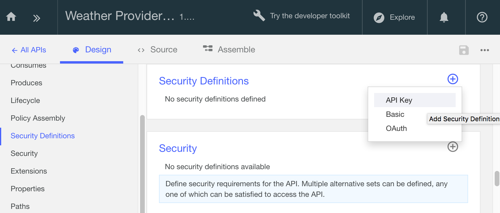
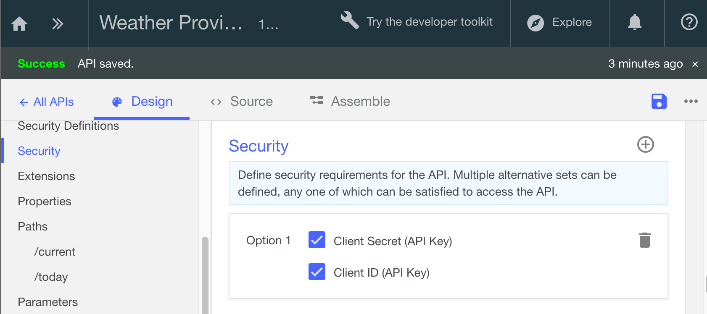
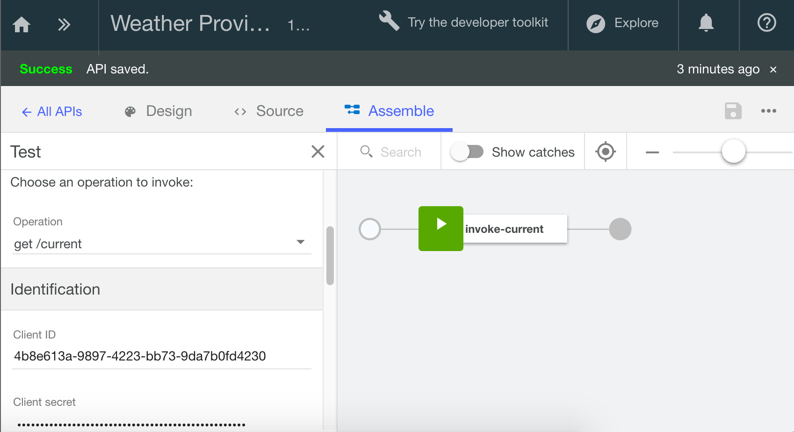
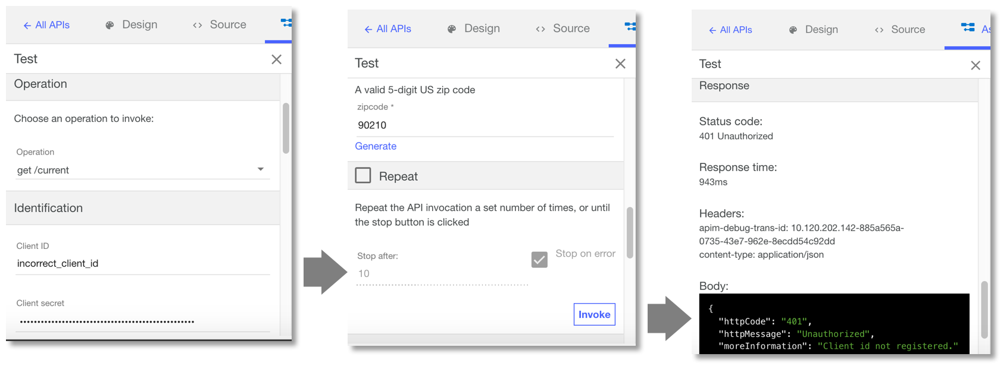
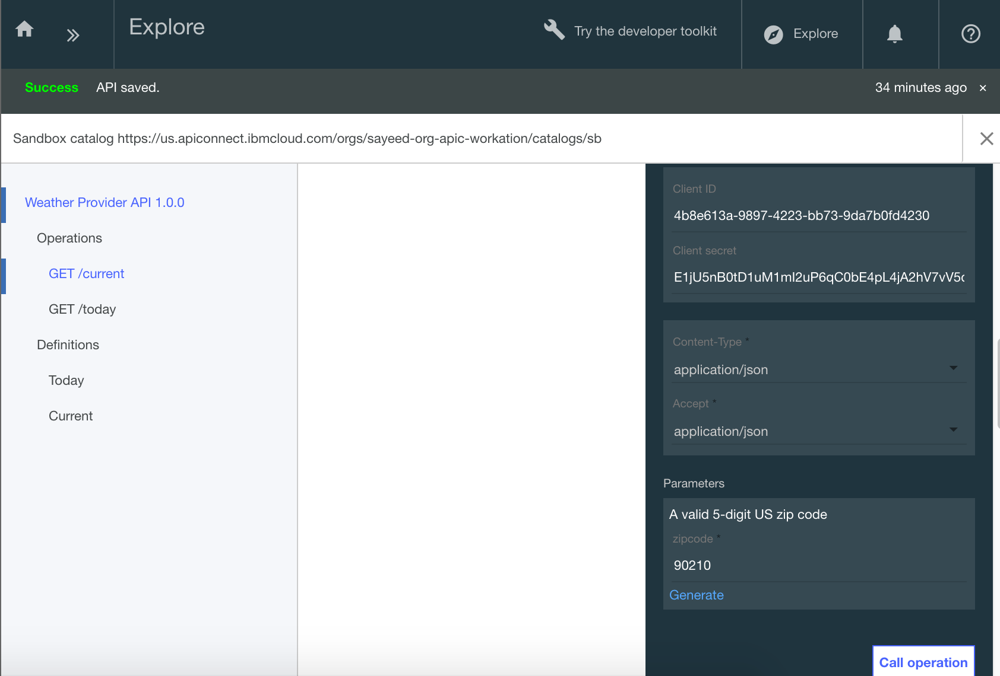

---

copyright:
  years: 2017
lastupdated: "2017-10-31"

keywords: IBM Cloud, APIs, lifecycle, catalog, manage, toolkit, develop, dev portal, tutorials

subcollection: apiconnect

---

{:external: target="_blank" .external}
{:shortdesc: .shortdesc}
{:screen: .screen}
{:codeblock: .codeblock}
{:pre: .pre}
{:note: .note}

# Securing your API with Client ID and Client Secret using IBM Cloud
{: #tut_secure_id_secret_bm}

**Duration:** 10 mins  
**Skill level:** Beginner

## Objective
{: #object_tut_secure_id_secret_bm}
This tutorial guides you through securing your API with a Client ID and a Client Secret. When applications are registered in your Developer Portal, a Client ID is generated to identify the application. Optionally, a Client Secret (which serves as a password) can also be generated. Applications need to supply the Client ID and Client Secret keys when they call your API.

## Prerequisites
{: #prereq_tut_secure_id_secret_bm}

Before you begin, complete one of the following tutorials: 
- [Import an OpenAPI2.0 spec and proxy an existing REST service](/docs/apiconnect/tutorials?topic=apiconnect-tut_rest_landing).
- [Add a New API Spec and Invoke an Existing REST Service](/docs/apiconnect/tutorials?topic=apiconnect-tut_rest_landing).

## Set the identification mechanism of your API
{: #set_id_tut_secure_id_secret_bm}

1. Navigate to your API's Design view:  
   a. Click **Drafts** in the navigation panel.
   b. Click the **APIs** tab. 
   c. Click the _Weather Provider API_ that you created in a previous tutorial. 
      The API opens to the **Design** view.  
     

2. In the Design view:
    a. In the **Security Definitions** section, click **Add Security Definitions** (the + icon), and then click **API Key**.  
    b. Add the following two API keys: 
       For both keys, ensure that the "Located In" field is set to "Header".	
      - Name: Client ID;  Parameter name: X-IBM-Client-Id  
      - Name: Client Secret;  Parameter name: X-IBM-Client-Secret    
          

3. In the "Security" section, add a new security option:  
    a. Select the Client ID and Client Secret keys.  
    b. Save your API.  
    c. Click the **Assemble** tab.  
      

## Test the changes made to your API
{: #test_tut_secure_id_secret_bm}

1. In the Assemble tab, click the Test icon to test your changes.

2. In the Test page's Setup panel, click **Republish product** to get the latest changes. 
  This option updates your API product, and also publishes it to the Sandbox catalog.

3. When the product is republished, click the **get /current** operation in the test panel.
4. Look in the Test panel, and notice that the Client ID and Client Secret values have already been populated. 
   These are test values that are generated for your sandbox, and represent the keys of the application that will be using your API.
  
   The Client ID and Client Secret keys can also be found under Dashboard > Catalog > Settings > Endpoints. 
   {: Note}
  
  

5. Enter a valid US zip code (for example, 90210). 
6. Click **Invoke**.
   The API returns `200 OK` response, along with the message body returning the weather information.
7. Return to the Client ID field. 
8. Replace the Client ID with a random value.
9. Run the test again by clicking **Invoke**. 
   This time, you receive the `401 Unauthorized` response with the message "Client ID not registered". 

      

## Call your API using the Client ID and Client Secret
{: #call_tut_secure_id_secret_bm}

The security settings can also be tested using the Explore tool. The Explore tool explicitly calls the proxy endpoint, and passes the Client ID and Client Secret keys as header values.

1. Click **Explore**, then click **Sandbox**.
    

2. Click the **GET /current** operation from the list.

3. Click **Call operation** to run the test.
    

---

## Conclusion
{: #conclusion_tut_secure_id_secret_bm}

In this tutorial, you learned how to set the identification mechanism of your API, test changes made to your API, and call your API using the Client ID and Client Secret. 

---

## Next step
{: #next_tut_secure_id_secret_bm}

Start to socialize your API by [setting up and configuring a developer portal](/docs/apiconnect/tutorials?topic=apiconnect-tut_config_dev_portal).

Create > Manage > **Secure** > Socialize > Analyze