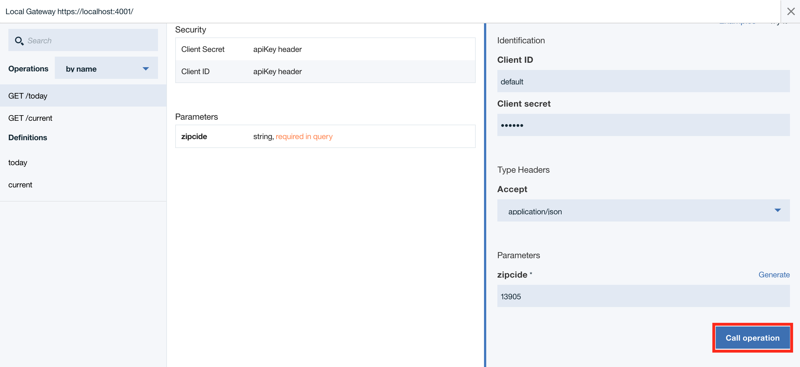

---

copyright:
  years: 2017
lastupdated: "2017-10-31"

keywords: IBM Cloud, APIs, lifecycle, catalog, manage, toolkit, develop, dev portal, tutorials

subcollection: apiconnect

---

{:new_window: target="blank"}
{:shortdesc: .shortdesc}
{:screen: .screen}
{:codeblock: .codeblock}
{:pre: .pre}

# Securing your API with Client ID and Client Secret using the Developer Toolkit
{: #tut_secure_id_secret_tk}

**Duration:** 10 mins  
**Skill level:** Beginner

## Objective
{: #object_tut_secure_id_secret_tk}

This tutorial will guide you through securing your API with Client ID and Client Secret. When applications are registered in your Developer Portal, a Client ID is generated to identify the application. Optionally, a Client Secret, which serves as a password, can also be generated. Applications would need to supply the generated Client ID and Client Secret keys in order to access your API.

## Prerequisites
{: #prereq_tut_secure_id_secret_tk}

Before you begin, you must have completed one of the following tutorials:
- [Import an OpenAPI2.0 spec and proxy an existing REST service](/docs/services/apiconnect/tutorials?topic=apiconnect-tut_rest_landing)
**or**  
- [Add a New API Spec and Invoke an Existing REST Service](/docs/services/apiconnect/tutorials?topic=apiconnect-tut_rest_landing)

## Set the identification mechanism of your API
{: #set_id_tut_secure_id_secret_tk}

1. Launch the API Designer (if it is not already open):  
   a. Open your terminal.  
   b. Enter `apic edit` into the command line. _API Designer is launched in your web browser_    
   c. Click on **Sign in with {{site.data.keyword.Bluemix_notm}}**.  
   d. Enter your {{site.data.keyword.Bluemix_short}} login information.  

2. Navigate to your API's Design view:
    a. Click on **Drafts** in the left-navigation panel 
    b. Then click on the **APIs** tab
    c. Click on the _Weather Provider API_ that you created in the previous tutorial. This opens the API's **Design** view.  
      

3. In the Design view:  
   a. Scroll down to **Security Definitions**.  
     

   b. Click the **Add Security Definitions** icon (+), then click **API Key**.  
      - Name: Client ID; Parameter name: X-IBM-Client-ID  
      - Name: Client Secret; Parameter name: X-IBM-Client-Secret  
      - For both new keys, ensure that the **Located In** field is set to "Header".  
          

4. Scroll down to the **Security** panel and add a new security option.  
   a. Select the newly created Client ID and Client Secret keys.  
   b. Save your API.  
   c. Switch over to the **Assemble** tab.  
     

## Test the changes made to your API
{: #test_tut_secure_id_secret_tk}

1. In the Assemble tab, click ► to test your changes.
2. In the test panel, click on the **get /current** operation.
3. Scroll down in the test panel, and notice that Client ID and Client Secret values have already been populated. _These are test values that are generated for your sandbox, and represent the keys of the application that will be using your API._  
> Note: These Client ID and Client Secret keys can also be found under  **Dashboard** > **Catalog** > **Settings** > **Endpoints**  

 

4. Scroll further down and enter a zip code (e.g. 90210). 
5. Then click **Invoke**. _You should get a 200 OK response, along with the message body returning the weather information._  
6. Scroll back up to the Client ID field, and replace the Client ID value with a random one (to see behavior when an incorrect Client ID is passed)  
7. Rerun the test by clicking **Invoke**. _You'll see a 401 Unauthorized response, together with the message "Client ID not registered"._  
    
  

## Call your API using the Client ID and Client Secret
{: #call_tut_secure_id_secret_tk}

The security settings can also be tested using the Explore tool that explicitly calls the proxy endpoint, and passes the Client ID and Client Secret keys as header values.

1. Click **Explore**.
    

2. Click on the **GET /current** operation from the list.  

3. In the right-hand column, click **Call operation** to rerun the test.  
      
    
---

### Conclusion
{: #conclusion_tut_secure_id_secret_tk}

In this tutorial, you learned how to set the identification mechanism of your API, test changes made to your API, and call your API using the Client ID and Client secret. 

---

## Next step
{: #next_tut_secure_id_secret_tk}

Start to socialize your API by [setting up and configuring a developer portal](tut_config_dev_portal.html).

Create > Manage > **Secure** > Socialize > Analyze
